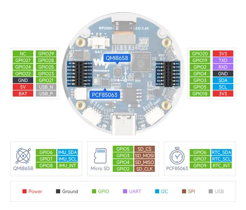
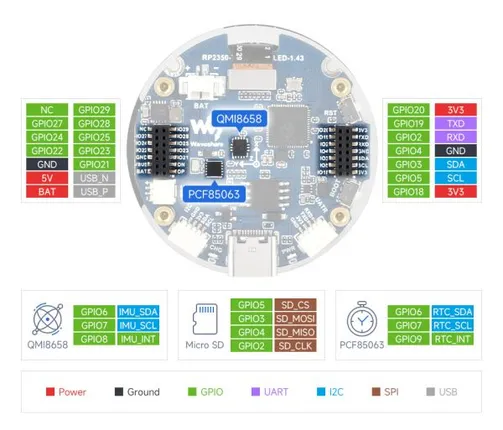

# RP2350-Touch-AMOLED-1.43

**Waveshare** · RP2350

Revision: Not identified  
Coverage: Pinout image collected

[Browse all manufacturers](../../../../BROWSE.md) · [Desktop app](https://github.com/valleytechsolutions/black-wire-desktop)

## Pinout

**pinout image** · Reviewed source · JPG

[Open original reference](../../../../library/media/bdbc77e5ecc3589eabdde9420bc154c9c65d9cd3b35222d99c652b3b315627cf.jpg)

**Credit and rights:** Not recorded; retain original attribution. Source/manufacturer: Waveshare.

[Source 1](https://www.waveshare.com/img/devkit/RP2350-Touch-AMOLED-1.43/RP2350-Touch-AMOLED-1.43-details-inter.jpg) · [Source 2](https://www.waveshare.com/rp2350-touch-amoled-1.43.htm)

SHA-256: `bdbc77e5ecc3589eabdde9420bc154c9c65d9cd3b35222d99c652b3b315627cf`

## Pinout

**pinout image** · Reviewed source · JPG

[Open original reference](../../../../library/media/fc608e4cd39950205b672cabf977a706361013511970af7aeee9e7f6495979a2.jpg)

**Credit and rights:** Not recorded; retain original attribution. Source/manufacturer: Waveshare.

[Source 1](https://www.waveshare.com/w/upload/0/03/600px-RP2350-Touch-AMOLED-1.43-details-inter.jpg) · [Source 2](https://www.waveshare.com/wiki/RP2350-Touch-AMOLED-1.43)

SHA-256: `fc608e4cd39950205b672cabf977a706361013511970af7aeee9e7f6495979a2`

Pin assignments have not been independently electrically verified. Check board revision before wiring.
