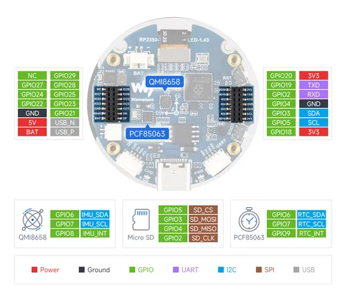
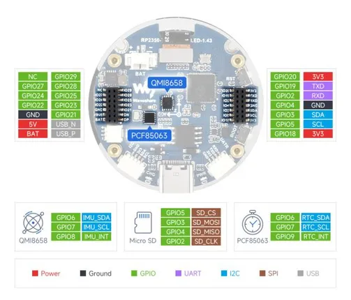

# RP2350-Touch-AMOLED-1.43

**Waveshare** · RP2350

Revision: Not identified

Coverage: Pinout image collected

[Browse all manufacturers](../../../../BROWSE.md) · [Devices & IoT](../../../../DEVICES.md) · [Open in the browser guide](https://valleytech-black-wire-guide.pages.dev/?board=waveshare-rp2350-rp2350-touch-amoled-1-43)

## Datasheets and original documentation

Board datasheet: **not yet recorded**. Visual reference: **available**.

[Manufacturer source (recorded link)](https://www.waveshare.com/rp2350-touch-amoled-1.43.htm)

A chip datasheet, schematic and board datasheet have different scopes. Match the exact hardware revision.

[Documentation coverage and remaining gaps](../../../../DOCUMENTATION.md)

## Pinout

**pinout image** · Reviewed source · JPG

[Open original reference](../../../../library/media/bdbc77e5ecc3589eabdde9420bc154c9c65d9cd3b35222d99c652b3b315627cf.jpg)

**Credit and rights:** Not recorded; retain original attribution. Source/manufacturer: Waveshare.

[Source 1](https://www.waveshare.com/img/devkit/RP2350-Touch-AMOLED-1.43/RP2350-Touch-AMOLED-1.43-details-inter.jpg) · [Source 2](https://www.waveshare.com/rp2350-touch-amoled-1.43.htm)

Image revision: Not identified

SHA-256: `bdbc77e5ecc3589eabdde9420bc154c9c65d9cd3b35222d99c652b3b315627cf`

## Pinout

**pinout image** · Reviewed source · JPG

[Open original reference](../../../../library/media/fc608e4cd39950205b672cabf977a706361013511970af7aeee9e7f6495979a2.jpg)

**Credit and rights:** Not recorded; retain original attribution. Source/manufacturer: Waveshare.

[Source 1](https://www.waveshare.com/w/upload/0/03/600px-RP2350-Touch-AMOLED-1.43-details-inter.jpg) · [Source 2](https://www.waveshare.com/wiki/RP2350-Touch-AMOLED-1.43)

Image revision: Not identified

SHA-256: `fc608e4cd39950205b672cabf977a706361013511970af7aeee9e7f6495979a2`

Pin assignments have not been independently electrically verified. Check board revision before wiring.
