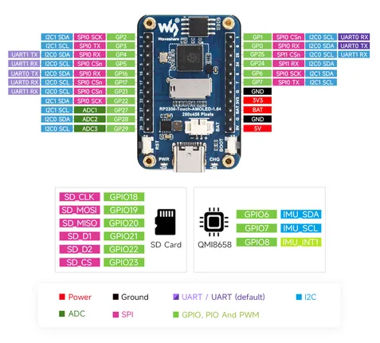
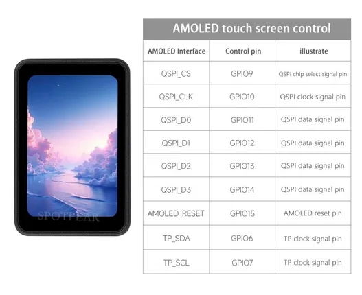

# RP2350-Touch-AMOLED-1.64

**Waveshare** · RP2350

Revision: Not identified  
Coverage: Pinout image collected

[Browse all manufacturers](../../../../BROWSE.md) · [Desktop app](https://github.com/valleytechsolutions/black-wire-desktop)

## Pinout

**pinout image** · Reviewed source · JPG

[Open original reference](../../../../library/media/cd3ef04dd3598e656c14ca6bc91ea93012445f910ebda3c82a5fca2120546204.jpg)

**Credit and rights:** Not recorded; retain original attribution. Source/manufacturer: Waveshare.

[Source 1](https://www.waveshare.com/img/devkit/RP2350-Touch-AMOLED-1.64-M/RP2350-Touch-AMOLED-1.64-M-details-intro.jpg) · [Source 2](https://www.waveshare.com/rp2350-touch-amoled-1.64-m.htm)

SHA-256: `cd3ef04dd3598e656c14ca6bc91ea93012445f910ebda3c82a5fca2120546204`

## Pinout

**pinout image** · Reviewed source · JPG

[Open original reference](../../../../library/media/a628cd31e1f3b3b38d411d896501fd085b678ac94090a15f0a3f93b2caf22e50.jpg)

**Credit and rights:** Not recorded; retain original attribution. Source/manufacturer: Waveshare.

[Source 1](https://www.waveshare.com/w/upload/0/0a/RP2350-Touch-AMOLED-1.64-details-intro.jpg) · [Source 2](https://www.waveshare.com/wiki/RP2350-Touch-AMOLED-1.64)

SHA-256: `a628cd31e1f3b3b38d411d896501fd085b678ac94090a15f0a3f93b2caf22e50`

## Display GPIO assignments

**GPIO reference image** · Reviewed source · JPG

[Open original reference](../../../../library/media/fbd53bf5b4d4f67bbf4a9ee1e2a17388579e3f0c7c238532de501e2a6cf9b8c3.jpg)

**Credit and rights:** Not established; source attribution retained. Source/manufacturer: Waveshare.

[Source 1](https://cdn.static.spotpear.com/uploads/picture/product/raspberry-pi/rpi-pico-expansion/RP2350-Touch-AMOLED-1.64/RP2350-Touch-AMOLED-1.64-details-09-EN.jpg) · [Source 2](https://spotpear.com/shop/Raspberry-Pi-Pico-2-RP2350-1.64-inch-AMOLED-280x456-Display-TouchScreen-QMI8658-QSPI.html)

Source image saved from Spotpear. Manufacturer matched using visible branding, model and existing manufacturer documentation.

SHA-256: `fbd53bf5b4d4f67bbf4a9ee1e2a17388579e3f0c7c238532de501e2a6cf9b8c3`

Pin assignments have not been independently electrically verified. Check board revision before wiring.
