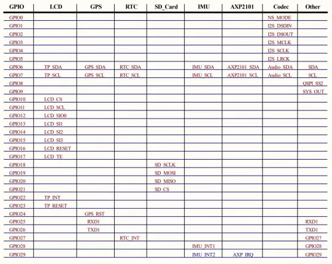

# RP2350-Touch-AMOLED-1.75

**Waveshare** · RP2350

Revision: Not identified  
Coverage: GPIO reference collected; physical pinout needed

[Browse all manufacturers](../../../../BROWSE.md) · [Desktop app](https://github.com/valleytechsolutions/black-wire-desktop)

## GPIO peripheral assignments

**GPIO reference image** · Reviewed source · WEBP

[Open original reference](../../../../library/media/ebd165a932a508f820812b71b8ae27a7fc9cad596d305ca3e5d4e2af4136e899.webp)

**Credit and rights:** Not established; source attribution retained. Source/manufacturer: Waveshare.

[Source 1](https://docs.waveshare.com/assets/images/RP2350-Touch-AMOLED-1.75-details-intro-1cd015a7be78b4b357681028c7e3db89.webp) · [Source 2](https://docs.waveshare.com/RP2350-Touch-AMOLED-1.75)

Official reference image. This is useful for board peripherals but must not be treated as a physical header/pad pinout. Board remains in the pinout research queue.

**Partial diagram. Confirm missing pins against the exact board documentation.**

SHA-256: `ebd165a932a508f820812b71b8ae27a7fc9cad596d305ca3e5d4e2af4136e899`

Pin assignments have not been independently electrically verified. Check board revision before wiring.
