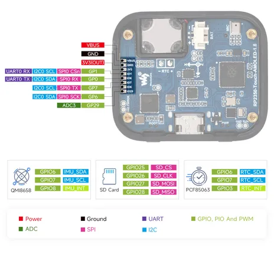

# RP2350-Touch-AMOLED-1.8

**Waveshare** · RP2350

Revision: Not identified  
Coverage: Pinout image collected

[Browse all manufacturers](../../../../BROWSE.md) · [Desktop app](https://github.com/valleytechsolutions/black-wire-desktop)

## Pinout

**pinout image** · Reviewed source · JPG

[Open original reference](../../../../library/media/7714c43901d8b6b3edddc6aa68d9cd76c5cdace088937b1dac00e9293feed409.jpg)

**Credit and rights:** Not recorded; retain original attribution. Source/manufacturer: Waveshare.

[Source 1](https://www.waveshare.com/img/devkit/RP2350-Touch-AMOLED-1.8/RP2350-Touch-AMOLED-1.8-details-inter.jpg) · [Source 2](https://www.waveshare.com/rp2350-touch-amoled-1.8.htm)

SHA-256: `7714c43901d8b6b3edddc6aa68d9cd76c5cdace088937b1dac00e9293feed409`

## Pinout

**pinout image** · Reviewed source · JPG

[Open original reference](../../../../library/media/cfd6abcd4c6cbd07b630858ff6bd356eba3af38267258ad5ab9cc03d36e8aac2.jpg)

**Credit and rights:** Not recorded; retain original attribution. Source/manufacturer: Waveshare.

[Source 1](https://www.waveshare.com/w/upload/c/c6/RP2350-Touch-AMOLED-1.8-details-inter.jpg) · [Source 2](https://www.waveshare.com/wiki/RP2350-Touch-AMOLED-1.8)

SHA-256: `cfd6abcd4c6cbd07b630858ff6bd356eba3af38267258ad5ab9cc03d36e8aac2`

Pin assignments have not been independently electrically verified. Check board revision before wiring.
