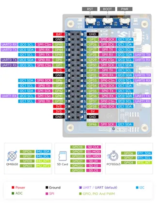
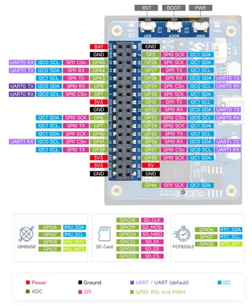
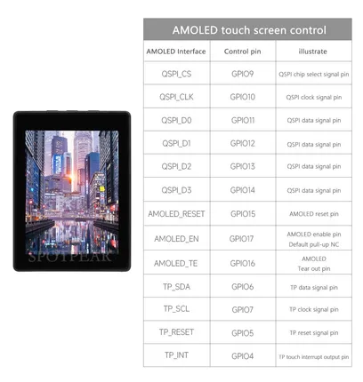

# RP2350-Touch-AMOLED-2.41

**Waveshare** · RP2350

Revision: Not identified  
Coverage: Pinout image collected

[Browse all manufacturers](../../../../BROWSE.md) · [Desktop app](https://github.com/valleytechsolutions/black-wire-desktop)

## Pinout

**pinout image** · Reviewed source · JPG

[Open original reference](../../../../library/media/64b4bda3161898a958890292b78a8d2069ef767e0f93dbea7d620d3768c0f48c.jpg)

**Credit and rights:** Not recorded; retain original attribution. Source/manufacturer: Waveshare.

[Source 1](https://www.waveshare.com/img/devkit/RP2350-Touch-AMOLED-2.41/RP2350-Touch-AMOLED-2.41-details-inter.jpg) · [Source 2](https://www.waveshare.com/rp2350-touch-amoled-2.41.htm)

SHA-256: `64b4bda3161898a958890292b78a8d2069ef767e0f93dbea7d620d3768c0f48c`

## Pinout

**pinout image** · Reviewed source · PNG

[Open original reference](../../../../library/media/cc9cfd251ce84d2524d98400ced97111ea16bf8c2ec253c7ccd8cd62fe5fadcf.png)

**Credit and rights:** Not recorded; retain original attribution. Source/manufacturer: Waveshare.

[Source 1](https://www.waveshare.com/w/upload/d/dc/700px-RP2350-Touch-AMOLED-2.41-details-inter.png) · [Source 2](https://www.waveshare.com/wiki/RP2350-Touch-AMOLED-2.41)

SHA-256: `cc9cfd251ce84d2524d98400ced97111ea16bf8c2ec253c7ccd8cd62fe5fadcf`

## Display GPIO assignments

**GPIO reference image** · Reviewed source · JPG

[Open original reference](../../../../library/media/76ec2e90a2818225166ca0c860f6dfdf2fe257d52379495f0d8802504a077d5f.jpg)

**Credit and rights:** Not established; source attribution retained. Source/manufacturer: Waveshare.

[Source 1](https://cdn.static.spotpear.com/uploads/picture/product/raspberry-pi/rpi-pico-expansion/RP2350-Touch-AMOLED-2.41/RP2350-Touch-AMOLED-2.41-details-10-EN.jpg) · [Source 2](https://spotpear.com/shop/Raspberry-Pi-Pico-2-RP2350B-2.41-inch-AMOLED-450x600-Display-TouchScreen-QMI8658-QSPI/RP2350-Touch-AMOLED-2.41.html)

Source image saved from Spotpear. Manufacturer matched using visible branding, model and existing manufacturer documentation.

SHA-256: `76ec2e90a2818225166ca0c860f6dfdf2fe257d52379495f0d8802504a077d5f`

Pin assignments have not been independently electrically verified. Check board revision before wiring.
