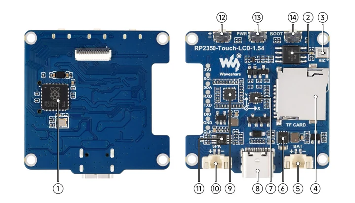
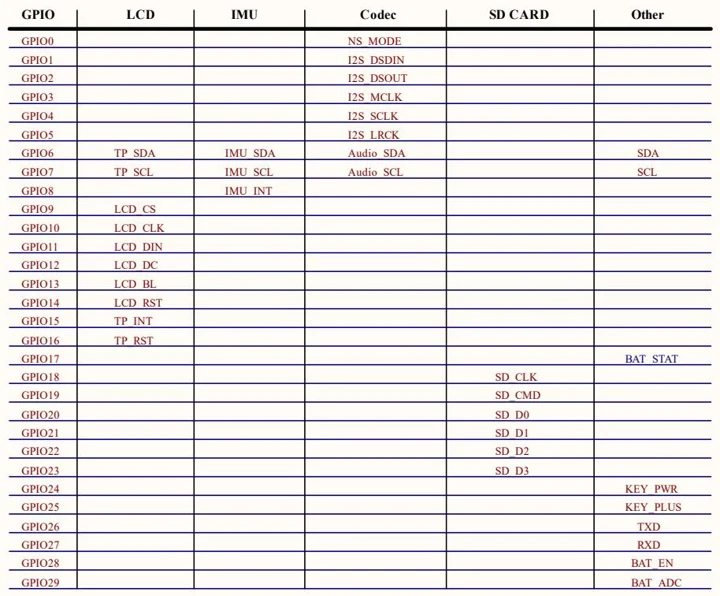
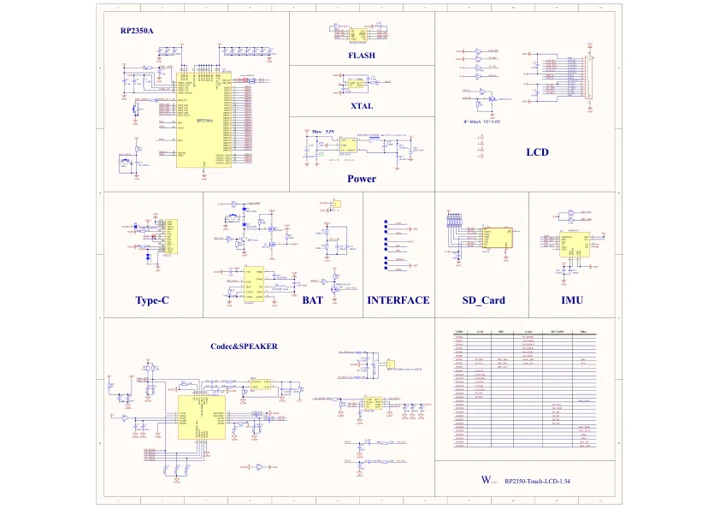

# RP2350-Touch-LCD-1.54

**Waveshare** · RP2350

Revision: Not identified

Coverage: Manufacturer references reviewed by scope; independent electrical and all-connector review pending

[Browse all manufacturers](../../../../BROWSE.md) · [Devices & IoT](../../../../DEVICES.md) · [Open in the browser guide](https://valleytech-black-wire-guide.pages.dev/?board=waveshare-rp2350-rp2350-touch-lcd-1-54)

## Datasheets and original documentation

Board datasheet: **not yet recorded**. Visual reference: **available**.

[Manufacturer hardware documentation](https://docs.waveshare.com/RP2350-Touch-LCD-1.54)

- **schematic / board**: [RP2350-Touch-LCD-1.54 Schematic Diagram](https://files.waveshare.com/wiki/RP2350-Touch-LCD-1.54/RP2350-Touch-LCD-1.54.pdf) · [saved document](../../../../library/media/753d5812b66cd59ee461963f1ccce586500665a5a6cbee6655d6ab6ee2ae96ec.pdf)
- **hardware-guide / board**: [Manufacturer pin and hardware documentation](https://docs.waveshare.com/RP2350-Touch-LCD-1.54) · online

A chip datasheet, schematic and board datasheet have different scopes. Match the exact hardware revision.

[Documentation coverage and remaining gaps](../../../../DOCUMENTATION.md)

## Onboard Resources ​

**board labeling image** · Source identity and visual scope inspected; PDF review covers first-page preview. Independent electrical and all-connector completeness review pending. · WEBP

[Open original reference](../../../../library/media/1c6ca11756c461a840102ec5cb7503c8c5522f589395aa8a04e6fe4eca4caae1.webp)

**Credit and rights:** Manufacturer artwork; reuse and print rights not established. Inclusion does not relicense the original.. Source/manufacturer: Waveshare.

[Source 1](https://docs.waveshare.com/assets/images/RP2350-Touch-LCD-1.54-details-inter-cf8f27e56355e0d8c6f13a7c02b5a79a.webp) · [Source 2](https://docs.waveshare.com/RP2350-Touch-LCD-1.54)

Manufacturer source retained unchanged. Source identity and visual scope inspected; PDF review covers first-page preview. Independent electrical and all-connector completeness review pending. See the linked manufacturer page for the numbered component legend. This is not a complete physical pinout.

Image revision: As supplied in the original; match exact board revision

SHA-256: `1c6ca11756c461a840102ec5cb7503c8c5522f589395aa8a04e6fe4eca4caae1`

## Interface Introduction ​

**pin function reference** · Source identity and visual scope inspected; PDF review covers first-page preview. Independent electrical and all-connector completeness review pending. · WEBP

[Open original reference](../../../../library/media/4b441ca8587f03b400d0847b2c234e49387d623fa38ac4d059a1711c5ddbcef1.webp)

**Credit and rights:** Manufacturer artwork; reuse and print rights not established. Inclusion does not relicense the original.. Source/manufacturer: Waveshare.

[Source 1](https://docs.waveshare.com/assets/images/RP2350-Touch-LCD-1.54-details-intro-6cc15e1cca42767126424b96e1711fd8.webp) · [Source 2](https://docs.waveshare.com/RP2350-Touch-LCD-1.54)

Manufacturer source retained unchanged. Source identity and visual scope inspected; PDF review covers first-page preview. Independent electrical and all-connector completeness review pending.

Image revision: As supplied in the original; match exact board revision

SHA-256: `4b441ca8587f03b400d0847b2c234e49387d623fa38ac4d059a1711c5ddbcef1`

## RP2350-Touch-LCD-1.54 Schematic Diagram

**original reference PDF** · Source identity and visual scope inspected; PDF review covers first-page preview. Independent electrical and all-connector completeness review pending. · PDF

[Open original reference](../../../../library/media/753d5812b66cd59ee461963f1ccce586500665a5a6cbee6655d6ab6ee2ae96ec.pdf)

**Credit and rights:** Manufacturer artwork; reuse and print rights not established. Inclusion does not relicense the original.. Source/manufacturer: Waveshare.

[Source 1](https://files.waveshare.com/wiki/RP2350-Touch-LCD-1.54/RP2350-Touch-LCD-1.54.pdf) · [Source 2](https://docs.waveshare.com/RP2350-Touch-LCD-1.54/Resources-And-Documents)

Manufacturer source retained unchanged. Source identity and visual scope inspected; PDF review covers first-page preview. Independent electrical and all-connector completeness review pending.

Image revision: As supplied in the original; match exact board revision

SHA-256: `753d5812b66cd59ee461963f1ccce586500665a5a6cbee6655d6ab6ee2ae96ec`

Pin assignments have not been independently electrically verified. Check board revision before wiring.
