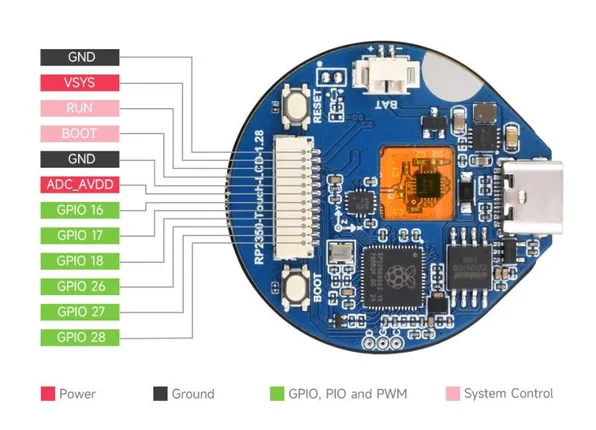

# RP2350-Touch-LCD-1.28

**Waveshare** · RP2350

Revision: Not identified  
Coverage: Pinout image collected

[Browse all manufacturers](../../../../BROWSE.md) · [Desktop app](https://github.com/valleytechsolutions/black-wire-desktop)

## Pinout

**pinout image** · Reviewed source · JPG

[Open original reference](../../../../library/media/2fcd354ccd54572306435b05b8407275e2c1f53aa3c813277a394cf0ac150779.jpg)

**Credit and rights:** Not recorded; retain original attribution. Source/manufacturer: Waveshare.

[Source 1](https://www.waveshare.com/img/devkit/RP2350-Touch-LCD-1.28/RP2350-Touch-LCD-1.28-details-11.jpg) · [Source 2](https://www.waveshare.com/rp2350-touch-lcd-1.28.htm)

SHA-256: `2fcd354ccd54572306435b05b8407275e2c1f53aa3c813277a394cf0ac150779`

## Pinout

**pinout image** · Reviewed source · JPG

[Open original reference](../../../../library/media/864e8c5806adda19ffb1d3f86e05cda054aaeb11d833df3caaf7d2b79bc42a91.jpg)

**Credit and rights:** Not recorded; retain original attribution. Source/manufacturer: Waveshare.

[Source 1](https://www.waveshare.com/w/upload/6/62/800px-RP2350-Touch-LCD-1.28-details-11.jpg) · [Source 2](https://www.waveshare.com/wiki/RP2350-Touch-LCD-1.28)

SHA-256: `864e8c5806adda19ffb1d3f86e05cda054aaeb11d833df3caaf7d2b79bc42a91`

Pin assignments have not been independently electrically verified. Check board revision before wiring.
