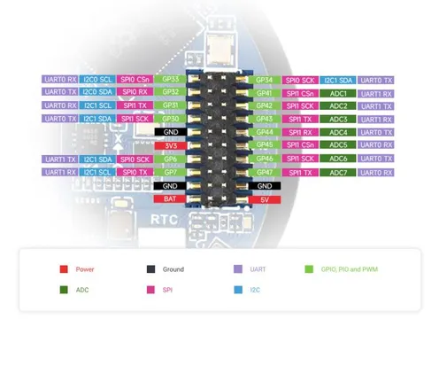

# RP2350-Touch-LCD-1.46

**Waveshare** · RP2350

Revision: Not identified

Coverage: Pinout image collected

[Browse all manufacturers](../../../../BROWSE.md) · [Devices & IoT](../../../../DEVICES.md) · [Open in the browser guide](https://valleytech-black-wire-guide.pages.dev/?board=waveshare-rp2350-rp2350-touch-lcd-1-46)

## Datasheets and original documentation

Board datasheet: **not yet recorded**. Visual reference: **available**.

[Manufacturer source (recorded link)](https://www.waveshare.com/rp2350-touch-lcd-1.46.htm)

A chip datasheet, schematic and board datasheet have different scopes. Match the exact hardware revision.

[Documentation coverage and remaining gaps](../../../../DOCUMENTATION.md)

## Pinout

**pinout image** · Reviewed source · JPG

[Open original reference](../../../../library/media/c505e4538ed1de670ee041fd4193c19b782e7f8d40545e1fde2198b8e06068c2.jpg)

**Credit and rights:** Not recorded; retain original attribution. Source/manufacturer: Waveshare.

[Source 1](https://www.waveshare.com/img/devkit/RP2350-Touch-LCD-1.46/RP2350-Touch-LCD-1.46-details-intro.jpg) · [Source 2](https://www.waveshare.com/rp2350-touch-lcd-1.46.htm)

Image revision: Not identified

SHA-256: `c505e4538ed1de670ee041fd4193c19b782e7f8d40545e1fde2198b8e06068c2`

## Pinout

**pinout image** · Reviewed source · JPG

[Open original reference](../../../../library/media/cf2c071575106d2ae05f4092b435df293f7603a74f7351f4ddda15cc05d9fbb2.jpg)

**Credit and rights:** Not recorded; retain original attribution. Source/manufacturer: Waveshare.

[Source 1](https://www.waveshare.com/w/upload/d/dd/700px-RP2350-Touch-LCD-1.46-details-intro.jpg) · [Source 2](https://www.waveshare.com/wiki/RP2350-Touch-LCD-1.46)

Image revision: Not identified

SHA-256: `cf2c071575106d2ae05f4092b435df293f7603a74f7351f4ddda15cc05d9fbb2`

Pin assignments have not been independently electrically verified. Check board revision before wiring.
