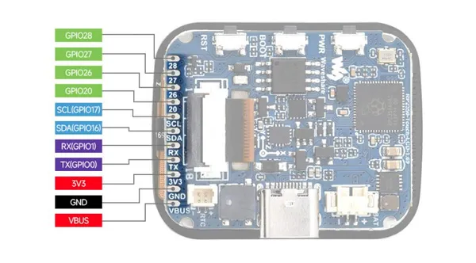

# RP2350-Touch-LCD-1.69

**Waveshare** · RP2350

Revision: Not identified  
Coverage: Pinout image collected

[Browse all manufacturers](../../../../BROWSE.md) · [Desktop app](https://github.com/valleytechsolutions/black-wire-desktop)

## Pinout

**pinout image** · Reviewed source · JPG

[Open original reference](../../../../library/media/8122323c8131b881b0f10876f1fa078cf02dd1042633b8985326a7f9998bf1cd.jpg)

**Credit and rights:** Not recorded; retain original attribution. Source/manufacturer: Waveshare.

[Source 1](https://www.waveshare.com/img/devkit/RP2350-Touch-LCD-1.69/RP2350-Touch-LCD-1.69-details-9.jpg) · [Source 2](https://www.waveshare.com/rp2350-touch-lcd-1.69.htm)

SHA-256: `8122323c8131b881b0f10876f1fa078cf02dd1042633b8985326a7f9998bf1cd`

## Pinout

**pinout image** · Reviewed source · JPG

[Open original reference](../../../../library/media/308b1a164ca770f73d2760f544a973975db746dba1d11c6d8f34d90118c15565.jpg)

**Credit and rights:** Not recorded; retain original attribution. Source/manufacturer: Waveshare.

[Source 1](https://www.waveshare.com/w/upload/5/58/800px-RP2350-Touch-LCD-1.69-details-9.jpg) · [Source 2](https://www.waveshare.com/wiki/RP2350-Touch-LCD-1.69)

SHA-256: `308b1a164ca770f73d2760f544a973975db746dba1d11c6d8f34d90118c15565`

Pin assignments have not been independently electrically verified. Check board revision before wiring.
