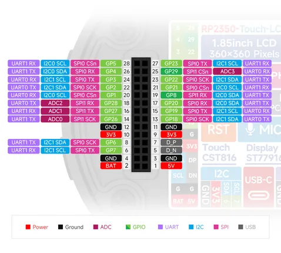

# RP2350-Touch-LCD-1.85C

**Waveshare** · RP2350

Revision: Not identified  
Coverage: Pinout image collected

[Browse all manufacturers](../../../../BROWSE.md) · [Desktop app](https://github.com/valleytechsolutions/black-wire-desktop)

## Pinout

**pinout image** · Reviewed source · JPG

[Open original reference](../../../../library/media/5b602c38aa1be59e02d1c200fbde924ae5b5a1e98f7290b779762f5fca4ebdbc.jpg)

**Credit and rights:** Not recorded; retain original attribution. Source/manufacturer: Waveshare.

[Source 1](https://www.waveshare.com/img/devkit/RP2350-Touch-LCD-1.85C/RP2350-Touch-LCD-1.85C-details-25.jpg) · [Source 2](https://www.waveshare.com/rp2350-touch-lcd-1.85c.htm)

SHA-256: `5b602c38aa1be59e02d1c200fbde924ae5b5a1e98f7290b779762f5fca4ebdbc`

## Pinout

**pinout image** · Reviewed source · JPG

[Open original reference](../../../../library/media/97f18a0b5ff9d11466cb929ab8d4a1914ca302bf5f34464d2c33b22352a11db3.jpg)

**Credit and rights:** Not recorded; retain original attribution. Source/manufacturer: Waveshare.

[Source 1](https://www.waveshare.com/w/upload/d/d5/RP2350-Touch-LCD-1.85C-details-25.jpg) · [Source 2](https://www.waveshare.com/wiki/RP2350-Touch-LCD-1.85C)

SHA-256: `97f18a0b5ff9d11466cb929ab8d4a1914ca302bf5f34464d2c33b22352a11db3`

Pin assignments have not been independently electrically verified. Check board revision before wiring.
