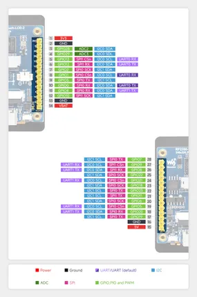
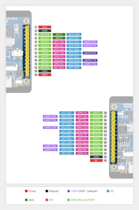

# RP2350-Touch-LCD-2

**Waveshare** · RP2350

Revision: Not identified  
Coverage: Pinout image collected

[Browse all manufacturers](../../../../BROWSE.md) · [Desktop app](https://github.com/valleytechsolutions/black-wire-desktop)

## Pinout

**pinout image** · Reviewed source · JPG

[Open original reference](../../../../library/media/9d5ee97595e8deabdd2f0c6fd1dc593ee6cf068a016d72b9cabb4ec6c24adba7.jpg)

**Credit and rights:** Not recorded; retain original attribution. Source/manufacturer: Waveshare.

[Source 1](https://www.waveshare.com/img/devkit/RP2350-Touch-LCD-2/RP2350-Touch-LCD-2-details-inter.jpg) · [Source 2](https://www.waveshare.com/rp2350-touch-lcd-2.htm)

SHA-256: `9d5ee97595e8deabdd2f0c6fd1dc593ee6cf068a016d72b9cabb4ec6c24adba7`

## Pinout

**pinout image** · Reviewed source · JPG

[Open original reference](../../../../library/media/6895adb145452a71123f14eea34185a58dce33e25f966047d8ce301aff08e18a.jpg)

**Credit and rights:** Not recorded; retain original attribution. Source/manufacturer: Waveshare.

[Source 1](https://www.waveshare.com/w/upload/b/b1/RP2350-Touch-LCD-2-details-19.jpg) · [Source 2](https://www.waveshare.com/wiki/RP2350-Touch-LCD-2)

SHA-256: `6895adb145452a71123f14eea34185a58dce33e25f966047d8ce301aff08e18a`

Pin assignments have not been independently electrically verified. Check board revision before wiring.
