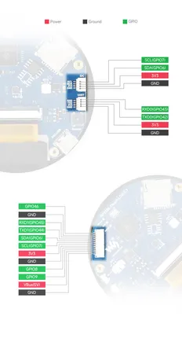

# RP2350-Touch-LCD-2.1

**Waveshare** · RP2350

Revision: Not identified  
Coverage: Pinout image collected

[Browse all manufacturers](../../../../BROWSE.md) · [Desktop app](https://github.com/valleytechsolutions/black-wire-desktop)

## Pinout

**pinout image** · Reviewed source · JPG

[Open original reference](../../../../library/media/2aad695a4fd04f4f58fb667662c48714e7f6cfada4dce7553cf15bba514a66af.jpg)

**Credit and rights:** Not recorded; retain original attribution. Source/manufacturer: Waveshare.

[Source 1](https://www.waveshare.com/img/devkit/RP2350-Touch-LCD-2.1/RP2350-Touch-LCD-2.1-details-9.jpg) · [Source 2](https://www.waveshare.com/rp2350-touch-lcd-2.1.htm)

SHA-256: `2aad695a4fd04f4f58fb667662c48714e7f6cfada4dce7553cf15bba514a66af`

## Pinout

**pinout image** · Reviewed source · JPG

[Open original reference](../../../../library/media/ac2851ec5cf09da5a9f5f41ece8a85300f6692c9c6d289d5134d1143a236ba05.jpg)

**Credit and rights:** Not recorded; retain original attribution. Source/manufacturer: Waveshare.

[Source 1](https://www.waveshare.com/w/upload/7/75/700px-RP2350-Touch-LCD-2.1-details-inter.jpg) · [Source 2](https://www.waveshare.com/wiki/RP2350-Touch-LCD-2.1)

SHA-256: `ac2851ec5cf09da5a9f5f41ece8a85300f6692c9c6d289d5134d1143a236ba05`

Pin assignments have not been independently electrically verified. Check board revision before wiring.
