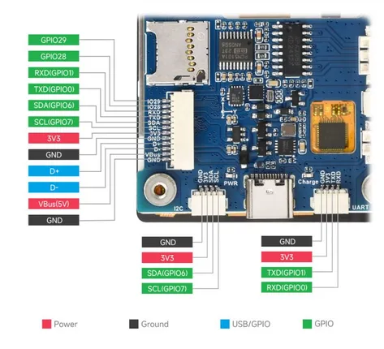

# RP2350-Touch-LCD-2.8

**Waveshare** · RP2350

Revision: Not identified

Coverage: Pinout image collected

[Browse all manufacturers](../../../../BROWSE.md) · [Devices & IoT](../../../../DEVICES.md) · [Open in the browser guide](https://valleytech-black-wire-guide.pages.dev/?board=waveshare-rp2350-rp2350-touch-lcd-2-8)

## Datasheets and original documentation

Board datasheet: **not yet recorded**. Visual reference: **available**.

[Manufacturer source (recorded link)](https://www.waveshare.com/rp2350-touch-lcd-2.8.htm)

A chip datasheet, schematic and board datasheet have different scopes. Match the exact hardware revision.

[Documentation coverage and remaining gaps](../../../../DOCUMENTATION.md)

## Pinout

**pinout image** · Reviewed source · JPG

[Open original reference](../../../../library/media/04863ba9d682255d3501b042c97bfaa5985f6579aabecb80a1bc9cb3b3fb7ddc.jpg)

**Credit and rights:** Not recorded; retain original attribution. Source/manufacturer: Waveshare.

[Source 1](https://www.waveshare.com/img/devkit/RP2350-Touch-LCD-2.8/RP2350-Touch-LCD-2.8-details-9.jpg) · [Source 2](https://www.waveshare.com/rp2350-touch-lcd-2.8.htm)

Image revision: Not identified

SHA-256: `04863ba9d682255d3501b042c97bfaa5985f6579aabecb80a1bc9cb3b3fb7ddc`

## Pinout

**pinout image** · Reviewed source · JPG

[Open original reference](../../../../library/media/f1b69f9e53b619a0642950c98b7650386e82e1f7bc0b38b8dfc19feed0a51193.jpg)

**Credit and rights:** Not recorded; retain original attribution. Source/manufacturer: Waveshare.

[Source 1](https://www.waveshare.com/w/upload/5/50/800px-RP2350-Touch-LCD-2.8-details-9.jpg) · [Source 2](https://www.waveshare.com/wiki/RP2350-Touch-LCD-2.8)

Image revision: Not identified

SHA-256: `f1b69f9e53b619a0642950c98b7650386e82e1f7bc0b38b8dfc19feed0a51193`

Pin assignments have not been independently electrically verified. Check board revision before wiring.
