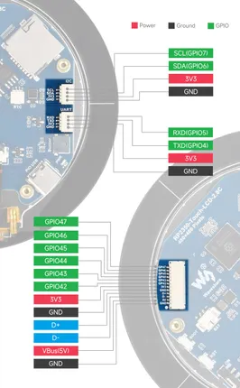

# RP2350-Touch-LCD-2.8C

**Waveshare** · RP2350

Revision: Not identified

Coverage: Pinout image collected

[Browse all manufacturers](../../../../BROWSE.md) · [Devices & IoT](../../../../DEVICES.md) · [Open in the browser guide](https://valleytech-black-wire-guide.pages.dev/?board=waveshare-rp2350-rp2350-touch-lcd-2-8c)

## Datasheets and original documentation

Board datasheet: **not yet recorded**. Visual reference: **available**.

[Manufacturer source (recorded link)](https://www.waveshare.com/rp2350-touch-lcd-2.8c.htm)

A chip datasheet, schematic and board datasheet have different scopes. Match the exact hardware revision.

[Documentation coverage and remaining gaps](../../../../DOCUMENTATION.md)

## Pinout

**pinout image** · Reviewed source · JPG

[Open original reference](../../../../library/media/d0e31cf30f35c593ea59fcae60bb71e8fe3f0c79d3d660f53c6cc6b62bd1fb16.jpg)

**Credit and rights:** Not recorded; retain original attribution. Source/manufacturer: Waveshare.

[Source 1](https://www.waveshare.com/img/devkit/RP2350-Touch-LCD-2.8C/RP2350-Touch-LCD-2.8C-details-inter.jpg) · [Source 2](https://www.waveshare.com/rp2350-touch-lcd-2.8c.htm)

Image revision: Not identified

SHA-256: `d0e31cf30f35c593ea59fcae60bb71e8fe3f0c79d3d660f53c6cc6b62bd1fb16`

## Pinout

**pinout image** · Reviewed source · JPG

[Open original reference](../../../../library/media/da65bd61a90b17fc216081770ff3d049f0f36016d83fd8e69b133d088622b640.jpg)

**Credit and rights:** Not recorded; retain original attribution. Source/manufacturer: Waveshare.

[Source 1](https://www.waveshare.com/w/upload/4/45/800px-RP2350-Touch-LCD-2.8C-details-inter.jpg) · [Source 2](https://www.waveshare.com/wiki/RP2350-Touch-LCD-2.8C)

Image revision: Not identified

SHA-256: `da65bd61a90b17fc216081770ff3d049f0f36016d83fd8e69b133d088622b640`

Pin assignments have not been independently electrically verified. Check board revision before wiring.
