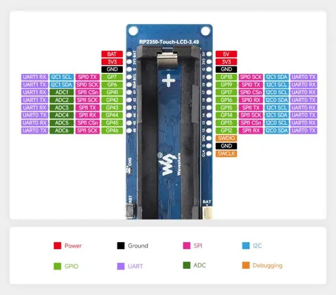

# RP2350-Touch-LCD-3.49

**Waveshare** · RP2350

Revision: Not identified  
Coverage: Pinout image collected

[Browse all manufacturers](../../../../BROWSE.md) · [Desktop app](https://github.com/valleytechsolutions/black-wire-desktop)

## Pinout

**pinout image** · Reviewed source · JPG

[Open original reference](../../../../library/media/da43df4df78a8a1b855811f703c379bf601d2c47b09e681007251185f3a910a3.jpg)

**Credit and rights:** Not recorded; retain original attribution. Source/manufacturer: Waveshare.

[Source 1](https://www.waveshare.com/img/devkit/RP2350-Touch-LCD-3.49/RP2350-Touch-LCD-3.49-details-inter.jpg) · [Source 2](https://www.waveshare.com/rp2350-touch-lcd-3.49.htm)

SHA-256: `da43df4df78a8a1b855811f703c379bf601d2c47b09e681007251185f3a910a3`

## Pinout

**pinout image** · Reviewed source · JPG

[Open original reference](../../../../library/media/fad703a4ce8cfb649368338a88ea065525213b1ad1fea86b2e5d9db772f1abca.jpg)

**Credit and rights:** Not recorded; retain original attribution. Source/manufacturer: Waveshare.

[Source 1](https://www.waveshare.com/w/upload/0/08/700px-RP2350-Touch-LCD-3.49-details-inter.jpg) · [Source 2](https://www.waveshare.com/wiki/RP2350-Touch-LCD-3.49)

SHA-256: `fad703a4ce8cfb649368338a88ea065525213b1ad1fea86b2e5d9db772f1abca`

Pin assignments have not been independently electrically verified. Check board revision before wiring.
