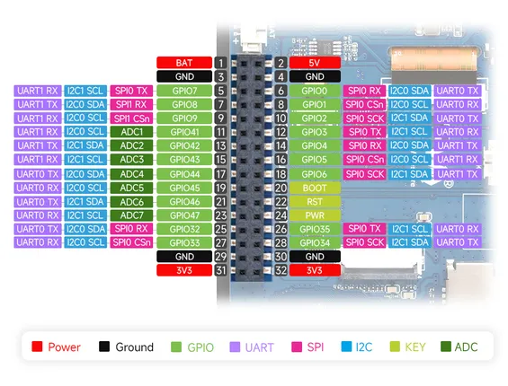
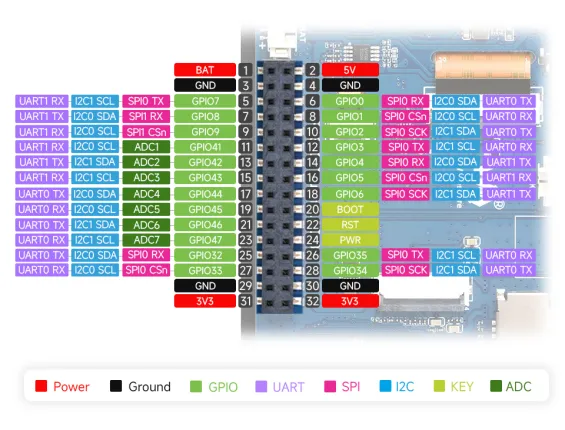

# RP2350-Touch-LCD-3.5

**Waveshare** · RP2350

Revision: Not identified  
Coverage: Pinout image collected

[Browse all manufacturers](../../../../BROWSE.md) · [Desktop app](https://github.com/valleytechsolutions/black-wire-desktop)

## Pinout

**pinout image** · Reviewed source · JPG

[Open original reference](../../../../library/media/cfad8ec93f701d4e9461038a6249eba49868ea259ac603b9ed983060ed6d7568.jpg)

**Credit and rights:** Not recorded; retain original attribution. Source/manufacturer: Waveshare.

[Source 1](https://www.waveshare.com/img/devkit/RP2350-Touch-LCD-3.5/RP2350-Touch-LCD-3.5-details-intro.jpg) · [Source 2](https://www.waveshare.com/rp2350-touch-lcd-3.5.htm)

SHA-256: `cfad8ec93f701d4e9461038a6249eba49868ea259ac603b9ed983060ed6d7568`

## Pinout

**pinout image** · Reviewed source · WEBP

[Open original reference](../../../../library/media/db28e1095b6271709a2acfeb6feda39f559cc8bdeeefcc224312cd749f54ab9f.webp)

**Credit and rights:** Not recorded; retain original attribution. Source/manufacturer: Waveshare.

[Source 1](https://docs.waveshare.com/assets/images/RP2350-Touch-LCD-3.5-details-intro-6760ffe22ff5495bd7b6baeedf74243c.webp) · [Source 2](https://docs.waveshare.com/RP2350-Touch-LCD-3.5)

SHA-256: `db28e1095b6271709a2acfeb6feda39f559cc8bdeeefcc224312cd749f54ab9f`

Pin assignments have not been independently electrically verified. Check board revision before wiring.
