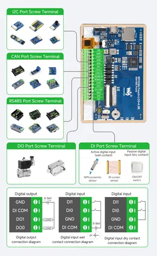

# RP2350-Touch-LCD-4.3B

**Waveshare** · RP2350

Revision: Not identified  
Coverage: Pinout image collected

[Browse all manufacturers](../../../../BROWSE.md) · [Desktop app](https://github.com/valleytechsolutions/black-wire-desktop)

## Pinout

**pinout image** · Reviewed source · JPG

[Open original reference](../../../../library/media/e0d237e8c9488dc52d9d947c6c2911d66e7e90b30f9b85558e10ec8c898eb1ba.jpg)

**Credit and rights:** Not recorded; retain original attribution. Source/manufacturer: Waveshare.

[Source 1](https://www.waveshare.com/img/devkit/RP2350-Touch-LCD-4.3B/RP2350-Touch-LCD-4.3B-details-13.jpg) · [Source 2](https://www.waveshare.com/rp2350-touch-lcd-4.3b.htm)

SHA-256: `e0d237e8c9488dc52d9d947c6c2911d66e7e90b30f9b85558e10ec8c898eb1ba`

Pin assignments have not been independently electrically verified. Check board revision before wiring.
