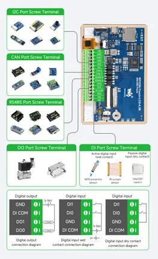

# RP2350-Touch-LCD-4.3B

**Waveshare** · RP2350

Revision: Not identified

Coverage: Pinout image collected

[Browse all manufacturers](../../../../BROWSE.md) · [Devices & IoT](../../../../DEVICES.md) · [Open in the browser guide](https://valleytech-black-wire-guide.pages.dev/?board=waveshare-rp2350-rp2350-touch-lcd-4-3b)

## Datasheets and original documentation

Board datasheet: **not yet recorded**. Visual reference: **available**.

[Manufacturer source (recorded link)](https://www.waveshare.com/rp2350-touch-lcd-4.3b.htm)

A chip datasheet, schematic and board datasheet have different scopes. Match the exact hardware revision.

[Documentation coverage and remaining gaps](../../../../DOCUMENTATION.md)

## Pinout

**pinout image** · Reviewed source · JPG

[Open original reference](../../../../library/media/e0d237e8c9488dc52d9d947c6c2911d66e7e90b30f9b85558e10ec8c898eb1ba.jpg)

**Credit and rights:** Not recorded; retain original attribution. Source/manufacturer: Waveshare.

[Source 1](https://www.waveshare.com/img/devkit/RP2350-Touch-LCD-4.3B/RP2350-Touch-LCD-4.3B-details-13.jpg) · [Source 2](https://www.waveshare.com/rp2350-touch-lcd-4.3b.htm)

Image revision: Not identified

SHA-256: `e0d237e8c9488dc52d9d947c6c2911d66e7e90b30f9b85558e10ec8c898eb1ba`

Pin assignments have not been independently electrically verified. Check board revision before wiring.
