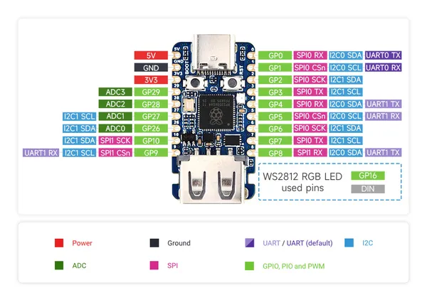
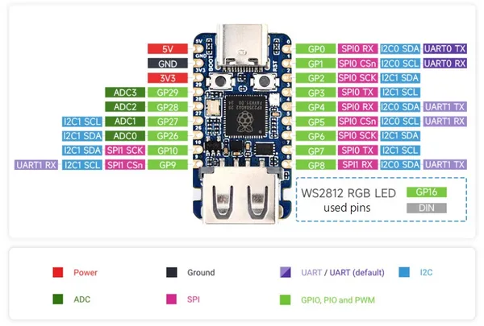

# RP2350-USB-A

**Waveshare** · RP2350

Revision: Not identified  
Coverage: Pinout image collected

[Browse all manufacturers](../../../../BROWSE.md) · [Desktop app](https://github.com/valleytechsolutions/black-wire-desktop)

## Pinout

**pinout image** · Reviewed source · JPG

[Open original reference](../../../../library/media/8cc6bd5e7f26c72405e3881c612a61db6a48694ae15a148c82dc45f86693bb13.jpg)

**Credit and rights:** Not recorded; retain original attribution. Source/manufacturer: Waveshare.

[Source 1](https://www.waveshare.com/img/devkit/RP2350-USB-A/RP2350-USB-A-details-6.jpg) · [Source 2](https://www.waveshare.com/rp2350-usb-a.htm)

SHA-256: `8cc6bd5e7f26c72405e3881c612a61db6a48694ae15a148c82dc45f86693bb13`

## Pinout

**pinout image** · Reviewed source · JPG

[Open original reference](../../../../library/media/79f7091a88fece9291c44c5cb2b593874d6bb7ebf6662e971063bb0ba2005f04.jpg)

**Credit and rights:** Not recorded; retain original attribution. Source/manufacturer: Waveshare.

[Source 1](https://www.waveshare.com/w/upload/6/64/680px-RP2350-USB-A-details-6.jpg) · [Source 2](https://www.waveshare.com/wiki/RP2350-USB-A)

SHA-256: `79f7091a88fece9291c44c5cb2b593874d6bb7ebf6662e971063bb0ba2005f04`

Pin assignments have not been independently electrically verified. Check board revision before wiring.
