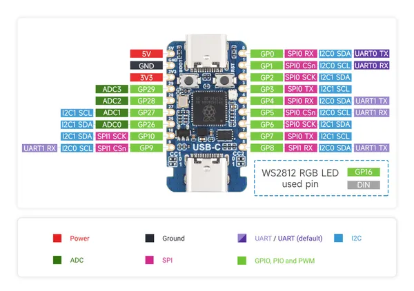
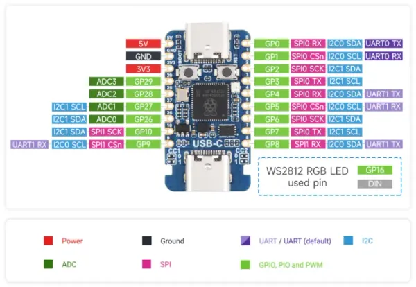

# RP2350-USB-C

**Waveshare** · RP2350

Revision: Not identified  
Coverage: Pinout image collected

[Browse all manufacturers](../../../../BROWSE.md) · [Desktop app](https://github.com/valleytechsolutions/black-wire-desktop)

## Pinout

**pinout image** · Reviewed source · JPG

[Open original reference](../../../../library/media/047790c395f11847aaa909ef075605cc0c9043393a499472739ab52db1a15d0d.jpg)

**Credit and rights:** Not recorded; retain original attribution. Source/manufacturer: Waveshare.

[Source 1](https://www.waveshare.com/img/devkit/RP2350-USB-C/RP2350-USB-C-details-5.jpg) · [Source 2](https://www.waveshare.com/rp2350-usb-c.htm)

SHA-256: `047790c395f11847aaa909ef075605cc0c9043393a499472739ab52db1a15d0d`

## Pinout

**pinout image** · Reviewed source · WEBP

[Open original reference](../../../../library/media/9a68c54cc59c5698d7db0e0c3d70065a18b335581e4aa1c8cf87f8abba6326e5.webp)

**Credit and rights:** Not recorded; retain original attribution. Source/manufacturer: Waveshare.

[Source 1](https://docs.waveshare.com/assets/images/RP2350-USB-C-details-intro-126ee744b46f6dfbd10b4e5cc83ff3eb.webp) · [Source 2](https://docs.waveshare.com/RP2350-USB-C)

SHA-256: `9a68c54cc59c5698d7db0e0c3d70065a18b335581e4aa1c8cf87f8abba6326e5`

Pin assignments have not been independently electrically verified. Check board revision before wiring.
