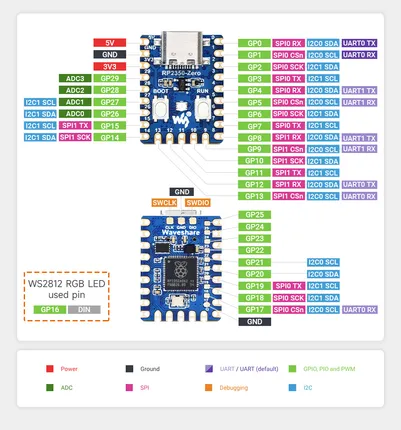

# RP2350-Zero

**Waveshare** · RP2350

Revision: Not identified

Coverage: Pinout image collected

[Browse all manufacturers](../../../../BROWSE.md) · [Devices & IoT](../../../../DEVICES.md) · [Open in the browser guide](https://valleytech-black-wire-guide.pages.dev/?board=waveshare-rp2350-rp2350-zero)

## Datasheets and original documentation

Board datasheet: **not yet recorded**. Visual reference: **available**.

[Manufacturer source (recorded link)](https://www.waveshare.com/rp2350-zero.htm)

A chip datasheet, schematic and board datasheet have different scopes. Match the exact hardware revision.

[Documentation coverage and remaining gaps](../../../../DOCUMENTATION.md)

## Pinout

**pinout image** · Reviewed source · JPG

[Open original reference](../../../../library/media/80181200d45770ca8985d30d2f46cf3c354ab1b591846cd8396ddb9ea948bdbc.jpg)

**Credit and rights:** Not recorded; retain original attribution. Source/manufacturer: Waveshare.

[Source 1](https://www.waveshare.com/img/devkit/RP2350-Zero/RP2350-Zero-details-7.jpg) · [Source 2](https://www.waveshare.com/rp2350-zero.htm)

Image revision: Not identified

SHA-256: `80181200d45770ca8985d30d2f46cf3c354ab1b591846cd8396ddb9ea948bdbc`

## Pinout

**pinout image** · Reviewed source · PNG

[Open original reference](../../../../library/media/4cca876993588b580bc3f1a2c07030381fea5955415457e9e89be42ddf8c00cf.png)

**Credit and rights:** Not recorded; retain original attribution. Source/manufacturer: Waveshare.

[Source 1](https://www.waveshare.com/w/upload/6/6d/800px-RP2350-Zero-details-7.png) · [Source 2](https://www.waveshare.com/wiki/RP2350-Zero)

Image revision: Not identified

SHA-256: `4cca876993588b580bc3f1a2c07030381fea5955415457e9e89be42ddf8c00cf`

Pin assignments have not been independently electrically verified. Check board revision before wiring.
