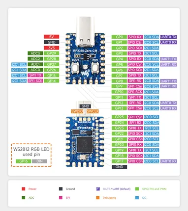
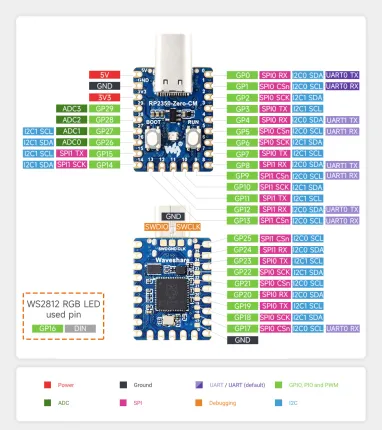

# RP2350-Zero-CM

**Waveshare** · RP2350

Revision: Not identified

Coverage: Pinout image collected

[Browse all manufacturers](../../../../BROWSE.md) · [Devices & IoT](../../../../DEVICES.md) · [Open in the browser guide](https://valleytech-black-wire-guide.pages.dev/?board=waveshare-rp2350-rp2350-zero-cm)

## Datasheets and original documentation

Board datasheet: **not yet recorded**. Visual reference: **available**.

[Manufacturer source (recorded link)](https://www.waveshare.com/rp2350-zero-cm.htm)

A chip datasheet, schematic and board datasheet have different scopes. Match the exact hardware revision.

[Documentation coverage and remaining gaps](../../../../DOCUMENTATION.md)

## Pinout

**pinout image** · Reviewed source · JPG

[Open original reference](../../../../library/media/09ad805a766a2b10e6c7b11ab33c666ef177ab56b19063a02ae1573ce3512504.jpg)

**Credit and rights:** Not recorded; retain original attribution. Source/manufacturer: Waveshare.

[Source 1](https://www.waveshare.com/img/devkit/RP2350-Zero-CM/RP2350-Zero-CM-details-7.jpg) · [Source 2](https://www.waveshare.com/rp2350-zero-cm.htm)

Image revision: Not identified

SHA-256: `09ad805a766a2b10e6c7b11ab33c666ef177ab56b19063a02ae1573ce3512504`

## Pinout

**pinout image** · Reviewed source · WEBP

[Open original reference](../../../../library/media/dbdfe9fbec7d447aa68199b5d0443d76d9231e93d4850b8e0de4a98aa41b4e6b.webp)

**Credit and rights:** Not recorded; retain original attribution. Source/manufacturer: Waveshare.

[Source 1](https://docs.waveshare.com/assets/images/RP2350-Zero-CM-details-intro-cbd11126f7f258fa174852e9ffc828b4.webp) · [Source 2](https://docs.waveshare.com/RP2350-Zero-CM)

Image revision: Not identified

SHA-256: `dbdfe9fbec7d447aa68199b5d0443d76d9231e93d4850b8e0de4a98aa41b4e6b`

Pin assignments have not been independently electrically verified. Check board revision before wiring.
