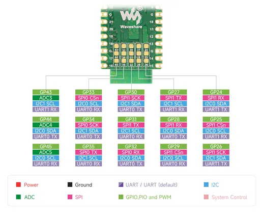
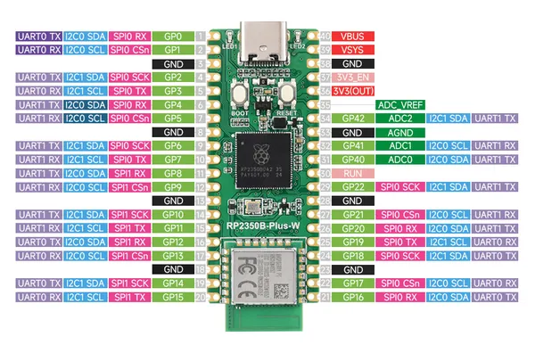
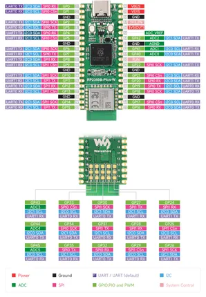

# RP2350B-Plus-W

**Waveshare** · RP2350

Revision: Not identified  
Coverage: Pinout image collected

[Browse all manufacturers](../../../../BROWSE.md) · [Desktop app](https://github.com/valleytechsolutions/black-wire-desktop)

## Pinout

**pinout image** · Reviewed source · JPG

[Open original reference](../../../../library/media/9da177d4dc2f105f009620c71c9fe8b3ac7d173c0affddaa096202491396d117.jpg)

**Credit and rights:** Not recorded; retain original attribution. Source/manufacturer: Waveshare.

[Source 1](https://www.waveshare.com/img/devkit/RP2350B-Plus-W/RP2350B-Plus-W-details-inter-1.jpg) · [Source 2](https://www.waveshare.com/rp2350b-plus-w.htm)

SHA-256: `9da177d4dc2f105f009620c71c9fe8b3ac7d173c0affddaa096202491396d117`

## Pinout

**pinout image** · Reviewed source · JPG

[Open original reference](../../../../library/media/1b21806fc6357529f415de851e009e12fc800adb7a6dca9e6cb78f7f2bc56b4e.jpg)

**Credit and rights:** Not recorded; retain original attribution. Source/manufacturer: Waveshare.

[Source 1](https://www.waveshare.com/img/devkit/RP2350B-Plus-W/RP2350B-Plus-W-details-inter.jpg) · [Source 2](https://www.waveshare.com/rp2350b-plus-w.htm)

SHA-256: `1b21806fc6357529f415de851e009e12fc800adb7a6dca9e6cb78f7f2bc56b4e`

## Pinout

**pinout image** · Reviewed source · PNG

[Open original reference](../../../../library/media/2bd48dcd383d9dbf66427977884239b10fb33d47d69d8622900edaae197883fa.png)

**Credit and rights:** Not recorded; retain original attribution. Source/manufacturer: Waveshare.

[Source 1](https://www.waveshare.com/w/upload/4/41/RP2350B-Plus-W-details-inter.png) · [Source 2](https://www.waveshare.com/wiki/RP2350B-Plus-W)

SHA-256: `2bd48dcd383d9dbf66427977884239b10fb33d47d69d8622900edaae197883fa`

Pin assignments have not been independently electrically verified. Check board revision before wiring.
