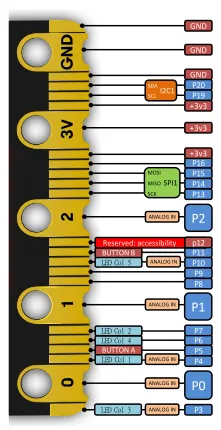

# Micro-bit V2

**Waveshare** · Source collection

Revision: Unverified source identity

Coverage: Source collection; review pending

[Browse all manufacturers](../../../../BROWSE.md) · [Devices & IoT](../../../../DEVICES.md) · [Open in the browser guide](https://valleytech-black-wire-guide.pages.dev/?board=source-board-43f9349d98852db142)

## Datasheets and original documentation

Board datasheet: **not yet recorded**. Visual reference: **available**.

Original manufacturer website still needs identification.

A chip datasheet, schematic and board datasheet have different scopes. Match the exact hardware revision.

[Documentation coverage and remaining gaps](../../../../DOCUMENTATION.md)

## Unreviewed reference

**source reference** · Unreviewed source · SVG

[Open original reference](../../../../library/media/bccba2469a9afd23e9e0e1f746dfb876e232d954bd636bb516aa4a4500fcdc3c.svg)

**Credit and rights:** Source rights not yet established. Source/manufacturer: Waveshare.

Original source index: Unreviewed reference. This file is searchable but has not been promoted to a reviewed physical board pinout.

Image revision: Not identified

SHA-256: `bccba2469a9afd23e9e0e1f746dfb876e232d954bd636bb516aa4a4500fcdc3c`

Pin assignments have not been independently electrically verified. Check board revision before wiring.
