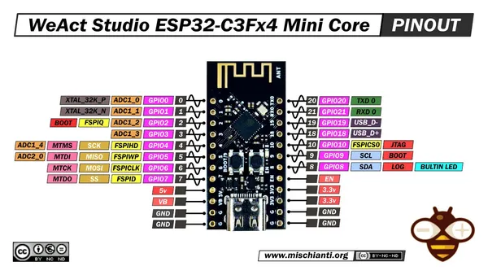
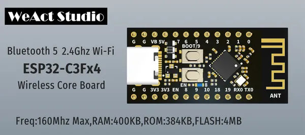

# ESP32C3 Core Board

**WeAct Studio** · ESP32-C3

Revision: Not identified  
Coverage: Pinout image collected

[Browse all manufacturers](../../../../BROWSE.md) · [Desktop app](https://github.com/valleytechsolutions/black-wire-desktop)

## Pinout - Renzo Mischianti

**pinout image** · Reviewed source · JPG

[Open original reference](../../../../library/media/5ce9b76a685cec17e8cb16f6c00bc71a77eb9271e4e5b7f1b1402e253c645113.jpg)

**Credit and rights:** CC BY-NC-ND marking visible on image; exact license version and publication permissions not established. Source/manufacturer: WeAct Studio.

[Source 1](https://mischianti.org/wp-content/uploads/2023/04/WeAct-Studio-ESP32-C3Fx4-Mini-Core-pinout-low.jpg) · [Source 2](https://mischianti.org/weact-studio-esp32-c3-core-high-resolution-pinout-and-specs/)

Original public image by Renzo Mischianti, unchanged. Diagram/model matching is visual, not electrical verification. Exact PCB layout and revision must match; no inference of compatibility with lookalike marketplace clones.

SHA-256: `5ce9b76a685cec17e8cb16f6c00bc71a77eb9271e4e5b7f1b1402e253c645113`

## Board silkscreen and component labels

**board labeling image** · Reviewed source · PNG

[Open original reference](../../../../library/media/b7648aaa60bc66ac3fcbeb3932c92c0e5db50876a88327e80de78e568833eb97.png)

**Credit and rights:** Not established; source attribution retained. Source/manufacturer: WeAct Studio.

[Source 1](https://raw.githubusercontent.com/WeActStudio/WeActStudio.ESP32C3CoreBoard/6edcf587bf7ffb3103974c91ef2b4a6c64516c76/Images/1.png) · [Source 2](https://github.com/WeActStudio/WeActStudio.ESP32C3CoreBoard/blob/6edcf587bf7ffb3103974c91ef2b4a6c64516c76/Images/1.png)

Original repository file preserved with commit identifier. Board illustration/silkscreen images are explicitly distinguished from expanded pin-function diagrams.

**Partial diagram. Confirm missing pins against the exact board documentation.**

SHA-256: `b7648aaa60bc66ac3fcbeb3932c92c0e5db50876a88327e80de78e568833eb97`

Pin assignments have not been independently electrically verified. Check board revision before wiring.
