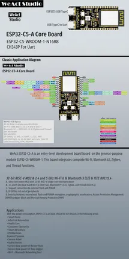

# ESP32-C5-A

**WeAct Studio** · ESP32-C5

Revision: Not identified  
Coverage: Pinout image collected

[Browse all manufacturers](../../../../BROWSE.md) · [Desktop app](https://github.com/valleytechsolutions/black-wire-desktop)

## Board pinout

**pinout image** · Reviewed source · PNG

[Open original reference](../../../../library/media/e3126a81b18cd178d7e848486181ab0cb9cee86ef4ff51538dc2d5730000fe52.png)

**Credit and rights:** Not established; source attribution retained. Source/manufacturer: WeAct Studio.

[Source 1](https://raw.githubusercontent.com/WeActStudio/WeActStudio.ESP32-C5-A/e7700f044572e25ca5e3de1b5b19281ee8f4b940/Images/介绍 - 1.png) · [Source 2](https://github.com/WeActStudio/WeActStudio.ESP32-C5-A)

SHA-256: `e3126a81b18cd178d7e848486181ab0cb9cee86ef4ff51538dc2d5730000fe52`

Pin assignments have not been independently electrically verified. Check board revision before wiring.
