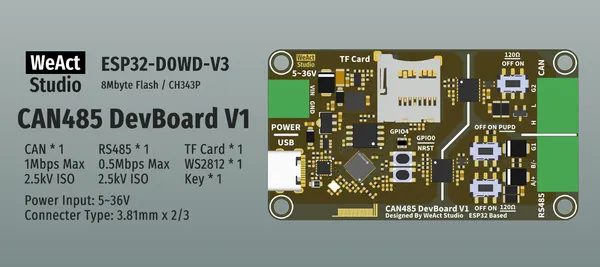
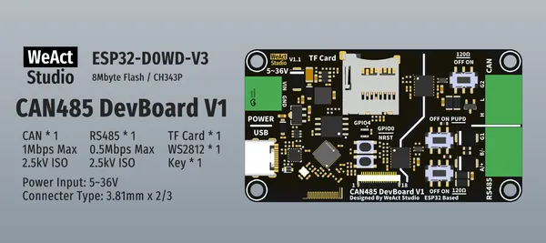

# CAN485DevBoardV1 ESP32

**WeAct Studio** · ESP32 original

Revision: Multiple source/revision records; see individual assets  
Coverage: Board labels only; pinout needed

[Browse all manufacturers](../../../../BROWSE.md) · [Desktop app](https://github.com/valleytechsolutions/black-wire-desktop)

## Board silkscreen and component labels

**board labeling image** · Reviewed source · PNG

[Open original reference](../../../../library/media/0bfdd27ee76661a349b68fd8bb7618447fed5a54eed854735e4f236b0bc10c0d.png)

**Credit and rights:** Not established; source attribution retained. Source/manufacturer: WeAct Studio.

[Source 1](https://raw.githubusercontent.com/WeActStudio/WeActStudio.CAN485DevBoardV1_ESP32/0865d397b931602d10bc740aa135b3a2c782340a/Images/1.png) · [Source 2](https://github.com/WeActStudio/WeActStudio.CAN485DevBoardV1_ESP32/blob/0865d397b931602d10bc740aa135b3a2c782340a/Images/1.png)

Original repository file preserved with commit identifier. Board illustration/silkscreen images are explicitly distinguished from expanded pin-function diagrams.

**Partial diagram. Confirm missing pins against the exact board documentation.**

SHA-256: `0bfdd27ee76661a349b68fd8bb7618447fed5a54eed854735e4f236b0bc10c0d`

## Board silkscreen and component labels

**board labeling image** · Reviewed source · PNG

[Open original reference](../../../../library/media/2f97fc6d68070f2e4187b089e658775b2419aff043e6026d2d5ebd589e856128.png)

**Credit and rights:** Not established; source attribution retained. Source/manufacturer: WeAct Studio.

[Source 1](https://raw.githubusercontent.com/WeActStudio/WeActStudio.CAN485DevBoardV1_ESP32/0865d397b931602d10bc740aa135b3a2c782340a/Images/1_new.png) · [Source 2](https://github.com/WeActStudio/WeActStudio.CAN485DevBoardV1_ESP32/blob/0865d397b931602d10bc740aa135b3a2c782340a/Images/1_new.png)

Original repository file preserved with commit identifier. Board illustration/silkscreen images are explicitly distinguished from expanded pin-function diagrams.

**Partial diagram. Confirm missing pins against the exact board documentation.**

SHA-256: `2f97fc6d68070f2e4187b089e658775b2419aff043e6026d2d5ebd589e856128`

Pin assignments have not been independently electrically verified. Check board revision before wiring.
