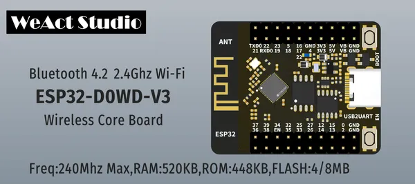

# ESP32 Core Board

**WeAct Studio** · ESP32 original

Revision: Not identified  
Coverage: Board labels only; pinout needed

[Browse all manufacturers](../../../../BROWSE.md) · [Desktop app](https://github.com/valleytechsolutions/black-wire-desktop)

## Board silkscreen and component labels

**board labeling image** · Reviewed source · PNG

[Open original reference](../../../../library/media/ca48a5c134353e2ccfa988d84a109f0cdad3311c8c3306a768c47d924cf211c8.png)

**Credit and rights:** Not established; source attribution retained. Source/manufacturer: WeAct Studio.

[Source 1](https://raw.githubusercontent.com/WeActStudio/WeActStudio.ESP32CoreBoard/a54db68d20f82cfb2c5e300be60e723732bcaf1f/Images/1.png) · [Source 2](https://github.com/WeActStudio/WeActStudio.ESP32CoreBoard/blob/a54db68d20f82cfb2c5e300be60e723732bcaf1f/Images/1.png)

Original repository file preserved with commit identifier. Board illustration/silkscreen images are explicitly distinguished from expanded pin-function diagrams.

**Partial diagram. Confirm missing pins against the exact board documentation.**

SHA-256: `ca48a5c134353e2ccfa988d84a109f0cdad3311c8c3306a768c47d924cf211c8`

Pin assignments have not been independently electrically verified. Check board revision before wiring.
