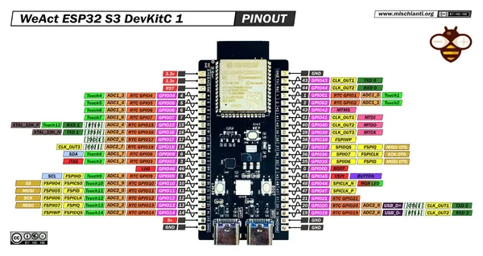

# ESP32S3-A

**WeAct Studio** · ESP32-S3

Revision: Not identified

Coverage: Pinout image collected

[Browse all manufacturers](../../../../BROWSE.md) · [Devices & IoT](../../../../DEVICES.md) · [Open in the browser guide](https://valleytech-black-wire-guide.pages.dev/?board=weact-studio-esp32-esp32s3-a)

## Datasheets and original documentation

Board datasheet: **not yet recorded**. Visual reference: **available**.

[Manufacturer source (recorded link)](https://github.com/WeActStudio/WeActStudio.ESP32S3-AorB)

A chip datasheet, schematic and board datasheet have different scopes. Match the exact hardware revision.

[Documentation coverage and remaining gaps](../../../../DOCUMENTATION.md)

## Pinout - Renzo Mischianti

**pinout image** · Reviewed source · JPG

[Open original reference](../../../../library/media/35ff0a996a12f265e804a98260f30f382fccd0dcdd2e7b7258eb9a8b890e7adf.jpg)

**Credit and rights:** CC BY-NC-ND marking visible on image; exact license version and publication permissions not established. Source/manufacturer: WeAct Studio.

[Source 1](https://mischianti.org/wp-content/uploads/2023/08/WeAct-esp32-S3-DevKitC-1-pinout-mischianti-low-1.jpg) · [Source 2](https://mischianti.org/weact-esp32-s3-a-devkitc-1-high-resolution-pinout-datasheet-and-specs/)

Original public image by Renzo Mischianti, unchanged. Diagram/model matching is visual, not electrical verification. Exact PCB layout and revision must match; no inference of compatibility with lookalike marketplace clones.

Image revision: Not identified

SHA-256: `35ff0a996a12f265e804a98260f30f382fccd0dcdd2e7b7258eb9a8b890e7adf`

Pin assignments have not been independently electrically verified. Check board revision before wiring.
