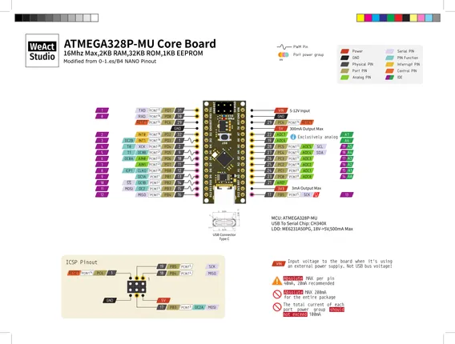
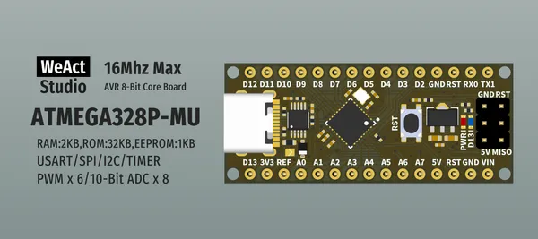

# ATMEGA328P Core Board

**WeAct Studio** · Other

Revision: Multiple source/revision records; see individual assets  
Coverage: Pinout image collected

[Browse all manufacturers](../../../../BROWSE.md) · [Desktop app](https://github.com/valleytechsolutions/black-wire-desktop)

## Manufacturer pinout

**pinout image** · Reviewed source · PNG

[Open original reference](../../../../library/media/03380ea932cb69921e82ccb0ad8cb0fd1ac221acb7226ff3f0b046b55aa88329.png)

**Credit and rights:** Not established; source attribution retained. Source/manufacturer: WeAct Studio.

[Source 1](https://raw.githubusercontent.com/WeActStudio/WeActStudio.ATMEGA328P_CoreBoard/3df63b2c27f818dbc581f91d7a302b6cfe67acce/Hardware/WeAct-ATMEGA328PMU_CoreBoard_V10%20Pinout.png) · [Source 2](https://github.com/WeActStudio/WeActStudio.ATMEGA328P_CoreBoard/blob/3df63b2c27f818dbc581f91d7a302b6cfe67acce/Hardware/WeAct-ATMEGA328PMU_CoreBoard_V10%20Pinout.png)

Original repository file preserved with commit identifier. Board illustration/silkscreen images are explicitly distinguished from expanded pin-function diagrams.

SHA-256: `03380ea932cb69921e82ccb0ad8cb0fd1ac221acb7226ff3f0b046b55aa88329`

## Board silkscreen and component labels

**board labeling image** · Reviewed source · PNG

[Open original reference](../../../../library/media/f016d6ad145256621e128b7093cad539ea9a6cd03e68d711d15a1b307aefd4db.png)

**Credit and rights:** Not established; source attribution retained. Source/manufacturer: WeAct Studio.

[Source 1](https://raw.githubusercontent.com/WeActStudio/WeActStudio.ATMEGA328P_CoreBoard/3df63b2c27f818dbc581f91d7a302b6cfe67acce/Images/1.png) · [Source 2](https://github.com/WeActStudio/WeActStudio.ATMEGA328P_CoreBoard/blob/3df63b2c27f818dbc581f91d7a302b6cfe67acce/Images/1.png)

Original repository file preserved with commit identifier. Board illustration/silkscreen images are explicitly distinguished from expanded pin-function diagrams.

**Partial diagram. Confirm missing pins against the exact board documentation.**

SHA-256: `f016d6ad145256621e128b7093cad539ea9a6cd03e68d711d15a1b307aefd4db`

## Original pinout reference PDF

**original reference PDF** · Reviewed source · PDF

[Open original reference](../../../../library/media/4361bec1737e21ef42c0e7ff5ffdbbcbb25229187a68e059bccf70466b63638d.pdf)

**Credit and rights:** Not established; source attribution retained. Source/manufacturer: WeAct Studio.

[Source 1](https://raw.githubusercontent.com/WeActStudio/WeActStudio.ATMEGA328P_CoreBoard/3df63b2c27f818dbc581f91d7a302b6cfe67acce/Hardware/WeAct-ATMEGA328PMU_CoreBoard_V10%20Pinout.pdf) · [Source 2](https://github.com/WeActStudio/WeActStudio.ATMEGA328P_CoreBoard/blob/3df63b2c27f818dbc581f91d7a302b6cfe67acce/Hardware/WeAct-ATMEGA328PMU_CoreBoard_V10%20Pinout.pdf)

SHA-256: `4361bec1737e21ef42c0e7ff5ffdbbcbb25229187a68e059bccf70466b63638d`

Pin assignments have not been independently electrically verified. Check board revision before wiring.
