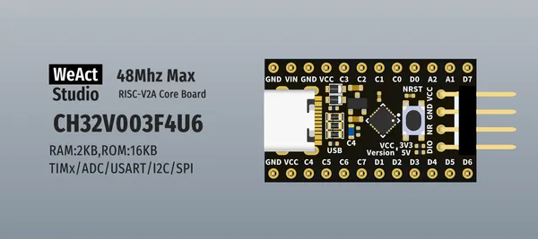

# CH32V003 Core Board

**WeAct Studio** · Other

Revision: Not identified  
Coverage: Board labels only; pinout needed

[Browse all manufacturers](../../../../BROWSE.md) · [Desktop app](https://github.com/valleytechsolutions/black-wire-desktop)

## Board silkscreen and component labels

**board labeling image** · Reviewed source · PNG

[Open original reference](../../../../library/media/0608e03174d8a0edacd76892f6361010a5721a859b6a95974f65be009cbcb331.png)

**Credit and rights:** Not established; source attribution retained. Source/manufacturer: WeAct Studio.

[Source 1](https://raw.githubusercontent.com/WeActStudio/WeActStudio.CH32V003CoreBoard/adfb1a9893e0d822024b0cbe3500a9f86b42ba18/Images/1.png) · [Source 2](https://github.com/WeActStudio/WeActStudio.CH32V003CoreBoard/blob/adfb1a9893e0d822024b0cbe3500a9f86b42ba18/Images/1.png)

Original repository file preserved with commit identifier. Board illustration/silkscreen images are explicitly distinguished from expanded pin-function diagrams.

**Partial diagram. Confirm missing pins against the exact board documentation.**

SHA-256: `0608e03174d8a0edacd76892f6361010a5721a859b6a95974f65be009cbcb331`

Pin assignments have not been independently electrically verified. Check board revision before wiring.
