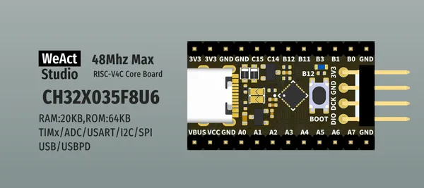

# CH32X035 Core Board

**WeAct Studio** · Other

Revision: Not identified  
Coverage: Board labels only; pinout needed

[Browse all manufacturers](../../../../BROWSE.md) · [Desktop app](https://github.com/valleytechsolutions/black-wire-desktop)

## Board silkscreen and component labels

**board labeling image** · Reviewed source · PNG

[Open original reference](../../../../library/media/280cddcf8991575992eb7b2c60a7732a680721c45ef592623a5f5899a3ed2a34.png)

**Credit and rights:** Not established; source attribution retained. Source/manufacturer: WeAct Studio.

[Source 1](https://raw.githubusercontent.com/WeActStudio/WeActStudio.CH32X035CoreBoard/6e97342657c121b1eb359aec47f82a626a242961/Images/1.png) · [Source 2](https://github.com/WeActStudio/WeActStudio.CH32X035CoreBoard/blob/6e97342657c121b1eb359aec47f82a626a242961/Images/1.png)

Original repository file preserved with commit identifier. Board illustration/silkscreen images are explicitly distinguished from expanded pin-function diagrams.

**Partial diagram. Confirm missing pins against the exact board documentation.**

SHA-256: `280cddcf8991575992eb7b2c60a7732a680721c45ef592623a5f5899a3ed2a34`

Pin assignments have not been independently electrically verified. Check board revision before wiring.
