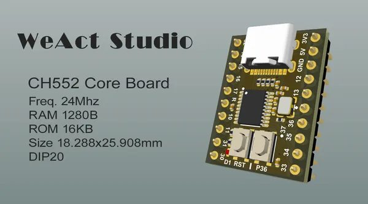

# CH552 Core Board

**WeAct Studio** · Other

Revision: Not identified  
Coverage: Board labels only; pinout needed

[Browse all manufacturers](../../../../BROWSE.md) · [Desktop app](https://github.com/valleytechsolutions/black-wire-desktop)

## Board silkscreen and component labels

**board labeling image** · Reviewed source · PNG

[Open original reference](../../../../library/media/10531c6abc7553e8bbfe50df9515798fb42a18fbc3eb1eeeb18f8341c2e45905.png)

**Credit and rights:** Not established; source attribution retained. Source/manufacturer: WeAct Studio.

[Source 1](https://raw.githubusercontent.com/WeActStudio/WeActStudio.CH552CoreBoard/ff6c6e391b4956b3e07b8181423744a587c71112/Images/image1.png) · [Source 2](https://github.com/WeActStudio/WeActStudio.CH552CoreBoard/blob/ff6c6e391b4956b3e07b8181423744a587c71112/Images/image1.png)

Original repository file preserved with commit identifier. Board illustration/silkscreen images are explicitly distinguished from expanded pin-function diagrams.

**Partial diagram. Confirm missing pins against the exact board documentation.**

SHA-256: `10531c6abc7553e8bbfe50df9515798fb42a18fbc3eb1eeeb18f8341c2e45905`

Pin assignments have not been independently electrically verified. Check board revision before wiring.
