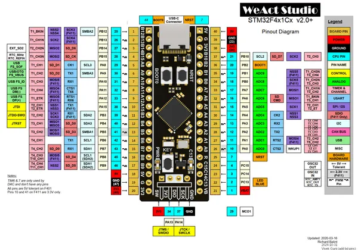
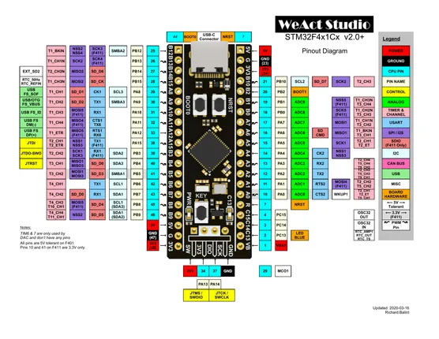
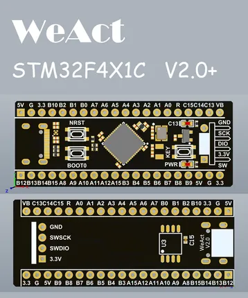

# MiniSTM32F4x1 (v2.0+)

**WeAct Studio** · Other

Revision: Multiple source/revision records; see individual assets  
Coverage: Pinout image collected

[Browse all manufacturers](../../../../BROWSE.md) · [Desktop app](https://github.com/valleytechsolutions/black-wire-desktop)

## Pinout - Richard Balint

**pinout image** · Reviewed source · PNG

[Open original reference](../../../../library/media/e176d55d4b353f9cbd52e6d7029ca364f2c2fa53ec03accbe2edfe64cf4d7748.png)

**Credit and rights:** Not established; source attribution retained. Source/manufacturer: WeAct Studio.

[Source 1](https://raw.githubusercontent.com/WeActStudio/WeActStudio.MiniSTM32F4x1/05380f5c41f38eea8966a81c5acdeb7512cd909f/images/STM32F4x1_PinoutDiagram_RichardBalint.png) · [Source 2](https://github.com/WeActStudio/WeActStudio.MiniSTM32F4x1/blob/05380f5c41f38eea8966a81c5acdeb7512cd909f/images/STM32F4x1_PinoutDiagram_RichardBalint.png)

Original repository file preserved with commit identifier. Board illustration/silkscreen images are explicitly distinguished from expanded pin-function diagrams.

SHA-256: `e176d55d4b353f9cbd52e6d7029ca364f2c2fa53ec03accbe2edfe64cf4d7748`

## Pin layout - PDF page 1

**pinout image** · Reviewed source · PNG

[Open original reference](../../../../library/media/a5d61bde884c4a5e1bbed1716482ca4595cf24b9e2f18cc259832284b39ebfef.png)

**Credit and rights:** Not established; source attribution retained. Source/manufacturer: WeAct Studio.

[Source 1](https://raw.githubusercontent.com/WeActStudio/WeActStudio.MiniSTM32F4x1/05380f5c41f38eea8966a81c5acdeb7512cd909f/General%20document/STM32F4x1%20v2.0%2B%20Pin%20Layout.pdf) · [Source 2](https://github.com/WeActStudio/WeActStudio.MiniSTM32F4x1/blob/05380f5c41f38eea8966a81c5acdeb7512cd909f/General%20document/STM32F4x1%20v2.0%2B%20Pin%20Layout.pdf)

Manufacturer original STM32F4x1 v2.0+ pin-layout PDF rendered at 220 dpi. Physical board reference; no pin labels changed.

SHA-256: `a5d61bde884c4a5e1bbed1716482ca4595cf24b9e2f18cc259832284b39ebfef`

## Board silkscreen and component labels

**board labeling image** · Reviewed source · PNG

[Open original reference](../../../../library/media/8905f7c4c7c65c0019026dd08fa160a6e63712fe31599b5ce4673d7f8d3a4bb8.png)

**Credit and rights:** Not established; source attribution retained. Source/manufacturer: WeAct Studio.

[Source 1](https://raw.githubusercontent.com/WeActStudio/WeActStudio.MiniSTM32F4x1/05380f5c41f38eea8966a81c5acdeb7512cd909f/images/STM32F4x1C_V20%2B.png) · [Source 2](https://github.com/WeActStudio/WeActStudio.MiniSTM32F4x1/blob/05380f5c41f38eea8966a81c5acdeb7512cd909f/images/STM32F4x1C_V20%2B.png)

Original repository file preserved with commit identifier. Board illustration/silkscreen images are explicitly distinguished from expanded pin-function diagrams.

**Partial diagram. Confirm missing pins against the exact board documentation.**

SHA-256: `8905f7c4c7c65c0019026dd08fa160a6e63712fe31599b5ce4673d7f8d3a4bb8`

## Original pinout reference PDF

**original reference PDF** · Reviewed source · PDF

[Open original reference](../../../../library/media/9b1a3b36a803108411bea313dd76947c3d5829927ee133d0dc17fdd55609d1d8.pdf)

**Credit and rights:** Not established; source attribution retained. Source/manufacturer: WeAct Studio.

[Source 1](https://raw.githubusercontent.com/WeActStudio/WeActStudio.MiniSTM32F4x1/05380f5c41f38eea8966a81c5acdeb7512cd909f/General%20document/STM32F4x1%20v2.0%2B%20Pin%20Layout.pdf) · [Source 2](https://github.com/WeActStudio/WeActStudio.MiniSTM32F4x1/blob/05380f5c41f38eea8966a81c5acdeb7512cd909f/General%20document/STM32F4x1%20v2.0%2B%20Pin%20Layout.pdf)

SHA-256: `9b1a3b36a803108411bea313dd76947c3d5829927ee133d0dc17fdd55609d1d8`

Pin assignments have not been independently electrically verified. Check board revision before wiring.
