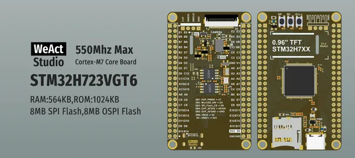

# MiniSTM32H723

**WeAct Studio** · Other

Revision: Not identified  
Coverage: Board labels only; pinout needed

[Browse all manufacturers](../../../../BROWSE.md) · [Desktop app](https://github.com/valleytechsolutions/black-wire-desktop)

## Board silkscreen and component labels

**board labeling image** · Reviewed source · PNG

[Open original reference](../../../../library/media/98ac04a30ae9e67f77515544ae64669a6fc1c9f33b06ab94d7665e760da74b6f.png)

**Credit and rights:** Not established; source attribution retained. Source/manufacturer: WeAct Studio.

[Source 1](https://raw.githubusercontent.com/WeActStudio/WeActStudio.MiniSTM32H723/0a08d2808291a7ff38c8a4f89748693019257345/Images/1.png) · [Source 2](https://github.com/WeActStudio/WeActStudio.MiniSTM32H723/blob/0a08d2808291a7ff38c8a4f89748693019257345/Images/1.png)

Original repository file preserved with commit identifier. Board illustration/silkscreen images are explicitly distinguished from expanded pin-function diagrams.

**Partial diagram. Confirm missing pins against the exact board documentation.**

SHA-256: `98ac04a30ae9e67f77515544ae64669a6fc1c9f33b06ab94d7665e760da74b6f`

Pin assignments have not been independently electrically verified. Check board revision before wiring.
