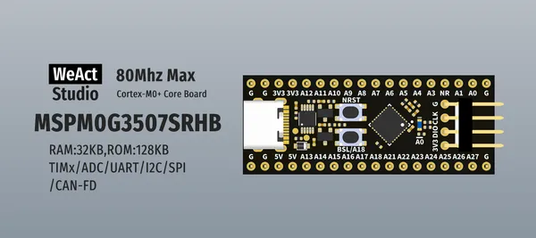

# MSPM0G3507 Core Board

**WeAct Studio** · Other

Revision: Not identified  
Coverage: Board labels only; pinout needed

[Browse all manufacturers](../../../../BROWSE.md) · [Desktop app](https://github.com/valleytechsolutions/black-wire-desktop)

## Board silkscreen and component labels

**board labeling image** · Reviewed source · PNG

[Open original reference](../../../../library/media/738e81fed510f3e95fe6e599998d71269d5c032a062788ab22f5dcfa0fedd59d.png)

**Credit and rights:** Not established; source attribution retained. Source/manufacturer: WeAct Studio.

[Source 1](https://raw.githubusercontent.com/WeActStudio/WeActStudio.MSPM0G3507CoreBoard/9f69a68b877a84120a1337aa1124b3191c4d4186/Images/1.png) · [Source 2](https://github.com/WeActStudio/WeActStudio.MSPM0G3507CoreBoard/blob/9f69a68b877a84120a1337aa1124b3191c4d4186/Images/1.png)

Original repository file preserved with commit identifier. Board illustration/silkscreen images are explicitly distinguished from expanded pin-function diagrams.

**Partial diagram. Confirm missing pins against the exact board documentation.**

SHA-256: `738e81fed510f3e95fe6e599998d71269d5c032a062788ab22f5dcfa0fedd59d`

Pin assignments have not been independently electrically verified. Check board revision before wiring.
