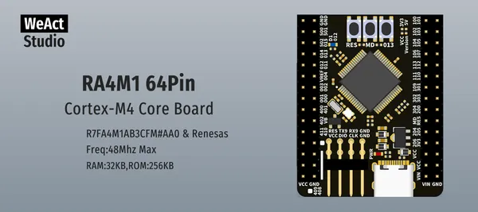

# RA4M1 64Pin Core Board

**WeAct Studio** · Other

Revision: Not identified  
Coverage: Board labels only; pinout needed

[Browse all manufacturers](../../../../BROWSE.md) · [Desktop app](https://github.com/valleytechsolutions/black-wire-desktop)

## Board silkscreen and component labels

**board labeling image** · Reviewed source · PNG

[Open original reference](../../../../library/media/e2caa85f670d9bde8b53dae5e73f94fba80ec44f21b59cd7bb8b197906f6f2d1.png)

**Credit and rights:** Not established; source attribution retained. Source/manufacturer: WeAct Studio.

[Source 1](https://raw.githubusercontent.com/WeActStudio/WeActStudio.RA4M1_64Pin_CoreBoard/a24b68f83bc482181d731e32e15dd1a709a47dae/Images/1.png) · [Source 2](https://github.com/WeActStudio/WeActStudio.RA4M1_64Pin_CoreBoard/blob/a24b68f83bc482181d731e32e15dd1a709a47dae/Images/1.png)

Original repository file preserved with commit identifier. Board illustration/silkscreen images are explicitly distinguished from expanded pin-function diagrams.

**Partial diagram. Confirm missing pins against the exact board documentation.**

SHA-256: `e2caa85f670d9bde8b53dae5e73f94fba80ec44f21b59cd7bb8b197906f6f2d1`

Pin assignments have not been independently electrically verified. Check board revision before wiring.
