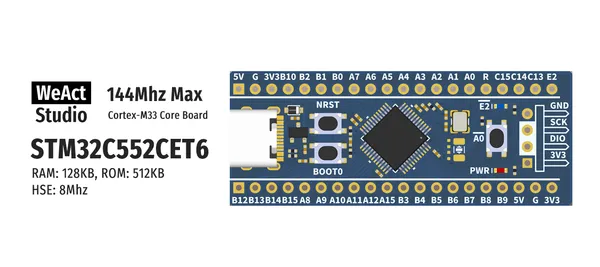

# STM32C5 48Pin Core Board

**WeAct Studio** · Other

Revision: Not identified  
Coverage: Board labels only; pinout needed

[Browse all manufacturers](../../../../BROWSE.md) · [Desktop app](https://github.com/valleytechsolutions/black-wire-desktop)

## Board silkscreen and component labels

**board labeling image** · Reviewed source · PNG

[Open original reference](../../../../library/media/d6850a3df497007256467e4fb0f3cd7e968e2e905a4624b667a321f3c809bf12.png)

**Credit and rights:** Not established; source attribution retained. Source/manufacturer: WeAct Studio.

[Source 1](https://raw.githubusercontent.com/WeActStudio/WeActStudio.STM32C5_48Pin_CoreBoard/c77ca0af90a8be033c9af6f169064c9828ab1124/Images/1.png) · [Source 2](https://github.com/WeActStudio/WeActStudio.STM32C5_48Pin_CoreBoard/blob/c77ca0af90a8be033c9af6f169064c9828ab1124/Images/1.png)

Original repository file preserved with commit identifier. Board illustration/silkscreen images are explicitly distinguished from expanded pin-function diagrams.

**Partial diagram. Confirm missing pins against the exact board documentation.**

SHA-256: `d6850a3df497007256467e4fb0f3cd7e968e2e905a4624b667a321f3c809bf12`

Pin assignments have not been independently electrically verified. Check board revision before wiring.
