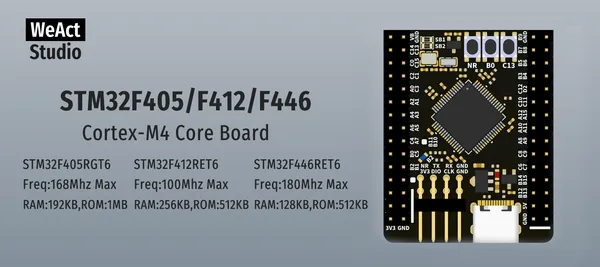
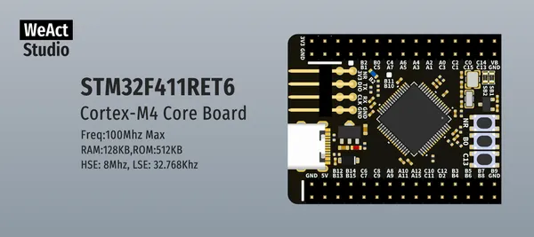

# STM32F4 64Pin Core Board

**WeAct Studio** · Other

Revision: Not identified  
Coverage: Board labels only; pinout needed

[Browse all manufacturers](../../../../BROWSE.md) · [Desktop app](https://github.com/valleytechsolutions/black-wire-desktop)

## Board silkscreen and component labels

**board labeling image** · Reviewed source · PNG

[Open original reference](../../../../library/media/98e0a7e8f22c15c46724d3a12586feac5510902662102c8c4912fba53c6e3e2c.png)

**Credit and rights:** Not established; source attribution retained. Source/manufacturer: WeAct Studio.

[Source 1](https://raw.githubusercontent.com/WeActStudio/WeActStudio.STM32F4_64Pin_CoreBoard/ff82fcef8b2c86de17ed5eaca488f3bac27b26ad/Images/1.png) · [Source 2](https://github.com/WeActStudio/WeActStudio.STM32F4_64Pin_CoreBoard/blob/ff82fcef8b2c86de17ed5eaca488f3bac27b26ad/Images/1.png)

Original repository file preserved with commit identifier. Board illustration/silkscreen images are explicitly distinguished from expanded pin-function diagrams.

**Partial diagram. Confirm missing pins against the exact board documentation.**

SHA-256: `98e0a7e8f22c15c46724d3a12586feac5510902662102c8c4912fba53c6e3e2c`

## Board silkscreen and component labels

**board labeling image** · Reviewed source · PNG

[Open original reference](../../../../library/media/fbe366271c294b623413275ab28a8543d60fd256a40c9b8e1de1092680540d5e.png)

**Credit and rights:** Not established; source attribution retained. Source/manufacturer: WeAct Studio.

[Source 1](https://raw.githubusercontent.com/WeActStudio/WeActStudio.STM32F4_64Pin_CoreBoard/ff82fcef8b2c86de17ed5eaca488f3bac27b26ad/Images/2.png) · [Source 2](https://github.com/WeActStudio/WeActStudio.STM32F4_64Pin_CoreBoard/blob/ff82fcef8b2c86de17ed5eaca488f3bac27b26ad/Images/2.png)

Original repository file preserved with commit identifier. Board illustration/silkscreen images are explicitly distinguished from expanded pin-function diagrams.

**Partial diagram. Confirm missing pins against the exact board documentation.**

SHA-256: `fbe366271c294b623413275ab28a8543d60fd256a40c9b8e1de1092680540d5e`

Pin assignments have not been independently electrically verified. Check board revision before wiring.
