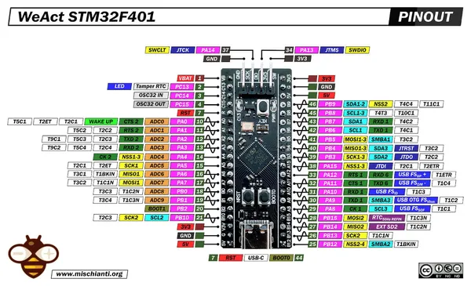

# STM32F401CCU6 Black Pill

**WeAct Studio** · Other

Revision: Not identified  
Coverage: Pinout image collected

[Browse all manufacturers](../../../../BROWSE.md) · [Desktop app](https://github.com/valleytechsolutions/black-wire-desktop)

## Pinout - Renzo Mischianti

**pinout image** · Reviewed source · JPG

[Open original reference](../../../../library/media/817c6fa5dd1a546b5b2272a7fab1a4a32b94b828649f11818877168b3379a390.jpg)

**Credit and rights:** CC BY-NC-ND marking visible on image; exact license version and publication permissions not established. Source/manufacturer: WeAct Studio.

[Source 1](https://mischianti.org/wp-content/uploads/2022/02/STM32-STM32F4-STM32F401-STM32F401CCU6-pinout-low-resolution.jpg) · [Source 2](https://mischianti.org/weact-stm32f401ccu6-black-pill-high-resolution-pinout-and-specs/)

Original public image by Renzo Mischianti, unchanged. Diagram/model matching is visual, not electrical verification. Exact PCB layout and revision must match; no inference of compatibility with lookalike marketplace clones.

SHA-256: `817c6fa5dd1a546b5b2272a7fab1a4a32b94b828649f11818877168b3379a390`

Pin assignments have not been independently electrically verified. Check board revision before wiring.
