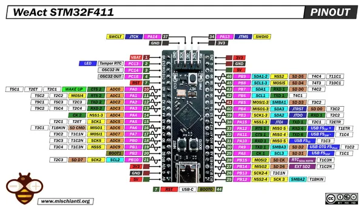

# STM32F411CEU6 Black Pill

**WeAct Studio** · Other

Revision: Not identified

Coverage: Pinout image collected

[Browse all manufacturers](../../../../BROWSE.md) · [Devices & IoT](../../../../DEVICES.md) · [Open in the browser guide](https://valleytech-black-wire-guide.pages.dev/?board=weact-studio-other-stm32f411ceu6-black-pill)

## Datasheets and original documentation

Board datasheet: **not yet recorded**. Visual reference: **available**.

Original manufacturer website still needs identification.

A chip datasheet, schematic and board datasheet have different scopes. Match the exact hardware revision.

[Documentation coverage and remaining gaps](../../../../DOCUMENTATION.md)

## Pinout - Renzo Mischianti

**pinout image** · Reviewed source · JPG

[Open original reference](../../../../library/media/ad5a4e290481dd7dab857551c48da5da2cf08344a8313271a08583adaccc9326.jpg)

**Credit and rights:** CC BY-NC-ND marking visible on image; exact license version and publication permissions not established. Source/manufacturer: WeAct Studio.

[Source 1](https://mischianti.org/wp-content/uploads/2022/02/STM32-STM32F4-STM32F411-STM32F411CEU6-pinout-low-resolution.jpg) · [Source 2](https://mischianti.org/weact-stm32f411ceu6-black-pill-high-resolution-pinout-and-specs/)

Original public image by Renzo Mischianti, unchanged. Diagram/model matching is visual, not electrical verification. Exact PCB layout and revision must match; no inference of compatibility with lookalike marketplace clones.

Image revision: Not identified

SHA-256: `ad5a4e290481dd7dab857551c48da5da2cf08344a8313271a08583adaccc9326`

Pin assignments have not been independently electrically verified. Check board revision before wiring.
