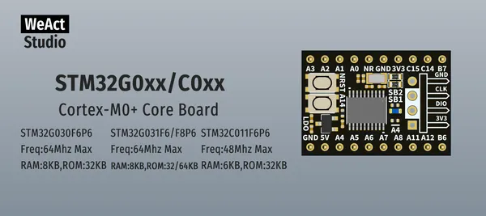

# STM32G0xxC0xx Core Board

**WeAct Studio** · Other

Revision: Not identified  
Coverage: Board labels only; pinout needed

[Browse all manufacturers](../../../../BROWSE.md) · [Desktop app](https://github.com/valleytechsolutions/black-wire-desktop)

## Board silkscreen and component labels

**board labeling image** · Reviewed source · PNG

[Open original reference](../../../../library/media/fef366ec172dbe7e9e4f11462d842192f0e7925330f511d558b20c47a8fd2646.png)

**Credit and rights:** Not established; source attribution retained. Source/manufacturer: WeAct Studio.

[Source 1](https://raw.githubusercontent.com/WeActStudio/WeActStudio.STM32G0xxC0xxCoreBoard/f692e4e2e853ae9610aa337e2222c6d6d73416d8/Images/1.png) · [Source 2](https://github.com/WeActStudio/WeActStudio.STM32G0xxC0xxCoreBoard/blob/f692e4e2e853ae9610aa337e2222c6d6d73416d8/Images/1.png)

Original repository file preserved with commit identifier. Board illustration/silkscreen images are explicitly distinguished from expanded pin-function diagrams.

**Partial diagram. Confirm missing pins against the exact board documentation.**

SHA-256: `fef366ec172dbe7e9e4f11462d842192f0e7925330f511d558b20c47a8fd2646`

Pin assignments have not been independently electrically verified. Check board revision before wiring.
