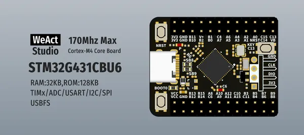
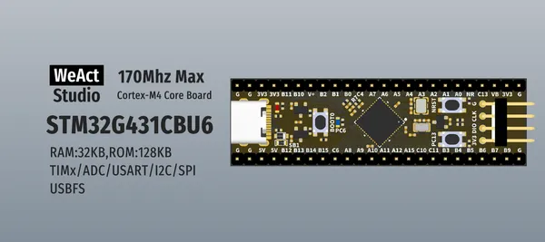
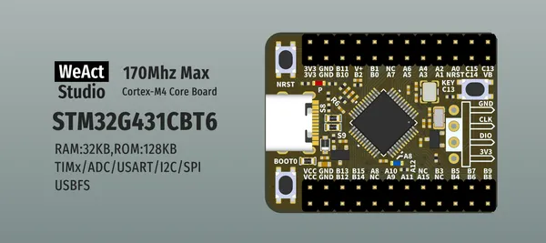
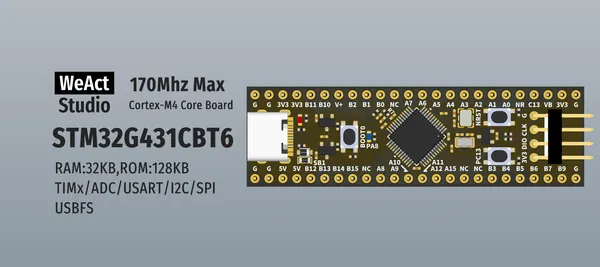

# STM32G431 Core Board

**WeAct Studio** · Other

Revision: Not identified  
Coverage: Board labels only; pinout needed

[Browse all manufacturers](../../../../BROWSE.md) · [Desktop app](https://github.com/valleytechsolutions/black-wire-desktop)

## Board silkscreen and component labels

**board labeling image** · Reviewed source · PNG

[Open original reference](../../../../library/media/26330936cb62c7900dbcb90e529a033994b26fa2e60742cae08fff14c16cf96f.png)

**Credit and rights:** Not established; source attribution retained. Source/manufacturer: WeAct Studio.

[Source 1](https://raw.githubusercontent.com/WeActStudio/WeActStudio.STM32G431CoreBoard/0af1943ee21bf7d5e172a2bfc6480d44aa229de3/Images/0.png) · [Source 2](https://github.com/WeActStudio/WeActStudio.STM32G431CoreBoard/blob/0af1943ee21bf7d5e172a2bfc6480d44aa229de3/Images/0.png)

Original repository file preserved with commit identifier. Board illustration/silkscreen images are explicitly distinguished from expanded pin-function diagrams.

**Partial diagram. Confirm missing pins against the exact board documentation.**

SHA-256: `26330936cb62c7900dbcb90e529a033994b26fa2e60742cae08fff14c16cf96f`

## Board silkscreen and component labels

**board labeling image** · Reviewed source · PNG

[Open original reference](../../../../library/media/1000437917a794828e8f203b7357b0e3531533b7ee97bc017b093823d82df42d.png)

**Credit and rights:** Not established; source attribution retained. Source/manufacturer: WeAct Studio.

[Source 1](https://raw.githubusercontent.com/WeActStudio/WeActStudio.STM32G431CoreBoard/0af1943ee21bf7d5e172a2bfc6480d44aa229de3/Images/1.png) · [Source 2](https://github.com/WeActStudio/WeActStudio.STM32G431CoreBoard/blob/0af1943ee21bf7d5e172a2bfc6480d44aa229de3/Images/1.png)

Original repository file preserved with commit identifier. Board illustration/silkscreen images are explicitly distinguished from expanded pin-function diagrams.

**Partial diagram. Confirm missing pins against the exact board documentation.**

SHA-256: `1000437917a794828e8f203b7357b0e3531533b7ee97bc017b093823d82df42d`

## Board silkscreen and component labels

**board labeling image** · Reviewed source · PNG

[Open original reference](../../../../library/media/bfc3d389dd9f3a184260e0cd5ee4d96e519a41aecd87a1aed75e49376960f5ba.png)

**Credit and rights:** Not established; source attribution retained. Source/manufacturer: WeAct Studio.

[Source 1](https://raw.githubusercontent.com/WeActStudio/WeActStudio.STM32G431CoreBoard/0af1943ee21bf7d5e172a2bfc6480d44aa229de3/Images/2.png) · [Source 2](https://github.com/WeActStudio/WeActStudio.STM32G431CoreBoard/blob/0af1943ee21bf7d5e172a2bfc6480d44aa229de3/Images/2.png)

Original repository file preserved with commit identifier. Board illustration/silkscreen images are explicitly distinguished from expanded pin-function diagrams.

**Partial diagram. Confirm missing pins against the exact board documentation.**

SHA-256: `bfc3d389dd9f3a184260e0cd5ee4d96e519a41aecd87a1aed75e49376960f5ba`

## Board silkscreen and component labels

**board labeling image** · Reviewed source · PNG

[Open original reference](../../../../library/media/e6696029f394faf1a1d2443215bb1ae7ceb175ff8e8fa40228433b3089e74464.png)

**Credit and rights:** Not established; source attribution retained. Source/manufacturer: WeAct Studio.

[Source 1](https://raw.githubusercontent.com/WeActStudio/WeActStudio.STM32G431CoreBoard/0af1943ee21bf7d5e172a2bfc6480d44aa229de3/Images/3.png) · [Source 2](https://github.com/WeActStudio/WeActStudio.STM32G431CoreBoard/blob/0af1943ee21bf7d5e172a2bfc6480d44aa229de3/Images/3.png)

Original repository file preserved with commit identifier. Board illustration/silkscreen images are explicitly distinguished from expanded pin-function diagrams.

**Partial diagram. Confirm missing pins against the exact board documentation.**

SHA-256: `e6696029f394faf1a1d2443215bb1ae7ceb175ff8e8fa40228433b3089e74464`

Pin assignments have not been independently electrically verified. Check board revision before wiring.
