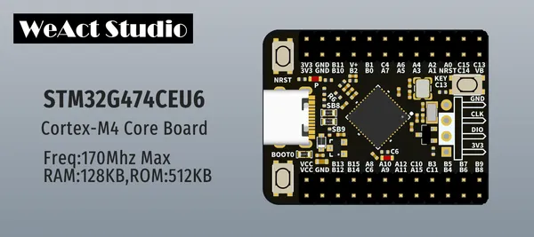
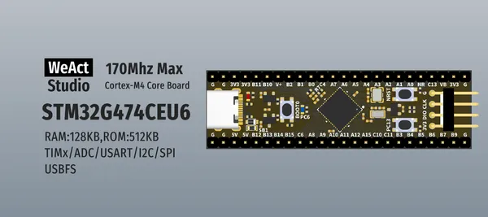
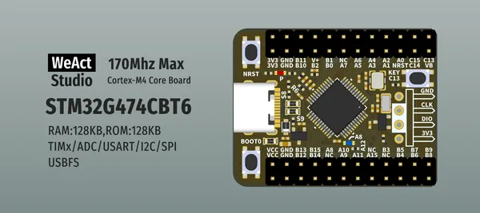
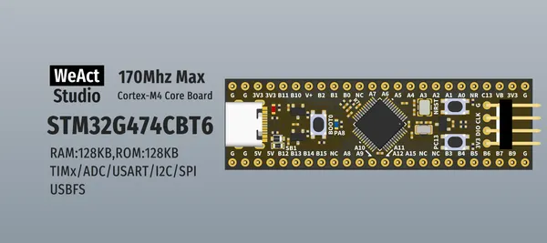

# STM32G474 Core Board

**WeAct Studio** · Other

Revision: Not identified  
Coverage: Board labels only; pinout needed

[Browse all manufacturers](../../../../BROWSE.md) · [Desktop app](https://github.com/valleytechsolutions/black-wire-desktop)

## Board silkscreen and component labels

**board labeling image** · Reviewed source · PNG

[Open original reference](../../../../library/media/13f9f3f1335710323d531e4091607d13817b0444d329cdaa3a73e8ed0492d367.png)

**Credit and rights:** Not established; source attribution retained. Source/manufacturer: WeAct Studio.

[Source 1](https://raw.githubusercontent.com/WeActStudio/WeActStudio.STM32G474CoreBoard/2bb4e50a0b8b0ec660d63615df9c358864d7bfea/Images/0.png) · [Source 2](https://github.com/WeActStudio/WeActStudio.STM32G474CoreBoard/blob/2bb4e50a0b8b0ec660d63615df9c358864d7bfea/Images/0.png)

Original repository file preserved with commit identifier. Board illustration/silkscreen images are explicitly distinguished from expanded pin-function diagrams.

**Partial diagram. Confirm missing pins against the exact board documentation.**

SHA-256: `13f9f3f1335710323d531e4091607d13817b0444d329cdaa3a73e8ed0492d367`

## Board silkscreen and component labels

**board labeling image** · Reviewed source · PNG

[Open original reference](../../../../library/media/0cca41bee01f4655b1ae831f18362188db7113cd3cedc7b2ab354b7b4cb5e721.png)

**Credit and rights:** Not established; source attribution retained. Source/manufacturer: WeAct Studio.

[Source 1](https://raw.githubusercontent.com/WeActStudio/WeActStudio.STM32G474CoreBoard/2bb4e50a0b8b0ec660d63615df9c358864d7bfea/Images/1.png) · [Source 2](https://github.com/WeActStudio/WeActStudio.STM32G474CoreBoard/blob/2bb4e50a0b8b0ec660d63615df9c358864d7bfea/Images/1.png)

Original repository file preserved with commit identifier. Board illustration/silkscreen images are explicitly distinguished from expanded pin-function diagrams.

**Partial diagram. Confirm missing pins against the exact board documentation.**

SHA-256: `0cca41bee01f4655b1ae831f18362188db7113cd3cedc7b2ab354b7b4cb5e721`

## Board silkscreen and component labels

**board labeling image** · Reviewed source · PNG

[Open original reference](../../../../library/media/7fefec6d05c247a31dc092566164b4cce782a1f911a2c39b3731472d660c57b3.png)

**Credit and rights:** Not established; source attribution retained. Source/manufacturer: WeAct Studio.

[Source 1](https://raw.githubusercontent.com/WeActStudio/WeActStudio.STM32G474CoreBoard/2bb4e50a0b8b0ec660d63615df9c358864d7bfea/Images/2.png) · [Source 2](https://github.com/WeActStudio/WeActStudio.STM32G474CoreBoard/blob/2bb4e50a0b8b0ec660d63615df9c358864d7bfea/Images/2.png)

Original repository file preserved with commit identifier. Board illustration/silkscreen images are explicitly distinguished from expanded pin-function diagrams.

**Partial diagram. Confirm missing pins against the exact board documentation.**

SHA-256: `7fefec6d05c247a31dc092566164b4cce782a1f911a2c39b3731472d660c57b3`

## Board silkscreen and component labels

**board labeling image** · Reviewed source · PNG

[Open original reference](../../../../library/media/11e2cb4801716b49af5ad0af8ef956d372229a35093e69966b219b7371a244ee.png)

**Credit and rights:** Not established; source attribution retained. Source/manufacturer: WeAct Studio.

[Source 1](https://raw.githubusercontent.com/WeActStudio/WeActStudio.STM32G474CoreBoard/2bb4e50a0b8b0ec660d63615df9c358864d7bfea/Images/3.png) · [Source 2](https://github.com/WeActStudio/WeActStudio.STM32G474CoreBoard/blob/2bb4e50a0b8b0ec660d63615df9c358864d7bfea/Images/3.png)

Original repository file preserved with commit identifier. Board illustration/silkscreen images are explicitly distinguished from expanded pin-function diagrams.

**Partial diagram. Confirm missing pins against the exact board documentation.**

SHA-256: `11e2cb4801716b49af5ad0af8ef956d372229a35093e69966b219b7371a244ee`

Pin assignments have not been independently electrically verified. Check board revision before wiring.
