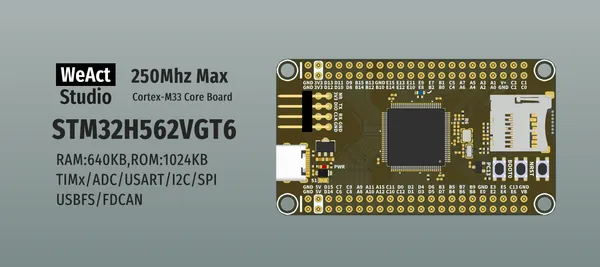

# STM32H5 100Pin Core Board

**WeAct Studio** · Other

Revision: Not identified  
Coverage: Board labels only; pinout needed

[Browse all manufacturers](../../../../BROWSE.md) · [Desktop app](https://github.com/valleytechsolutions/black-wire-desktop)

## Board silkscreen and component labels

**board labeling image** · Reviewed source · PNG

[Open original reference](../../../../library/media/81949008e8b1527500fe32d0827b9b5a4cbc1ac1a28e2f10f0db164b19e9fa15.png)

**Credit and rights:** Not established; source attribution retained. Source/manufacturer: WeAct Studio.

[Source 1](https://raw.githubusercontent.com/WeActStudio/WeActStudio.STM32H5_100Pin_CoreBoard/22cd66de0775b02ccdf7188d67e4327742030a15/Images/1.png) · [Source 2](https://github.com/WeActStudio/WeActStudio.STM32H5_100Pin_CoreBoard/blob/22cd66de0775b02ccdf7188d67e4327742030a15/Images/1.png)

Original repository file preserved with commit identifier. Board illustration/silkscreen images are explicitly distinguished from expanded pin-function diagrams.

**Partial diagram. Confirm missing pins against the exact board documentation.**

SHA-256: `81949008e8b1527500fe32d0827b9b5a4cbc1ac1a28e2f10f0db164b19e9fa15`

Pin assignments have not been independently electrically verified. Check board revision before wiring.
