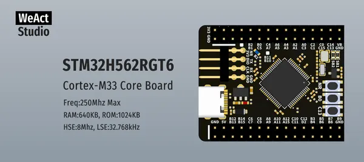

# STM32H5 64Pin Core Board

**WeAct Studio** · Other

Revision: Not identified  
Coverage: Board labels only; pinout needed

[Browse all manufacturers](../../../../BROWSE.md) · [Desktop app](https://github.com/valleytechsolutions/black-wire-desktop)

## Board silkscreen and component labels

**board labeling image** · Reviewed source · PNG

[Open original reference](../../../../library/media/c4da7c588b35958ed048af15c61bf1b1fdcd2191a72e2307e506b0c1d633090c.png)

**Credit and rights:** Not established; source attribution retained. Source/manufacturer: WeAct Studio.

[Source 1](https://raw.githubusercontent.com/WeActStudio/WeActStudio.STM32H5_64Pin_CoreBoard/36e2f38356e6c9ee66288d7f6f31fd522256aac0/Images/1.png) · [Source 2](https://github.com/WeActStudio/WeActStudio.STM32H5_64Pin_CoreBoard/blob/36e2f38356e6c9ee66288d7f6f31fd522256aac0/Images/1.png)

Original repository file preserved with commit identifier. Board illustration/silkscreen images are explicitly distinguished from expanded pin-function diagrams.

**Partial diagram. Confirm missing pins against the exact board documentation.**

SHA-256: `c4da7c588b35958ed048af15c61bf1b1fdcd2191a72e2307e506b0c1d633090c`

## Board silkscreen and component labels

**board labeling image** · Reviewed source · PNG

[Open original reference](../../../../library/media/43e3d577f30648f247fbd5091e3679df46302428b998988a9838fd58342c3a0e.png)

**Credit and rights:** Not established; source attribution retained. Source/manufacturer: WeAct Studio.

[Source 1](https://raw.githubusercontent.com/WeActStudio/WeActStudio.STM32H5_64Pin_CoreBoard/36e2f38356e6c9ee66288d7f6f31fd522256aac0/Images/2.png) · [Source 2](https://github.com/WeActStudio/WeActStudio.STM32H5_64Pin_CoreBoard/blob/36e2f38356e6c9ee66288d7f6f31fd522256aac0/Images/2.png)

Original repository file preserved with commit identifier. Board illustration/silkscreen images are explicitly distinguished from expanded pin-function diagrams.

**Partial diagram. Confirm missing pins against the exact board documentation.**

SHA-256: `43e3d577f30648f247fbd5091e3679df46302428b998988a9838fd58342c3a0e`

Pin assignments have not been independently electrically verified. Check board revision before wiring.
