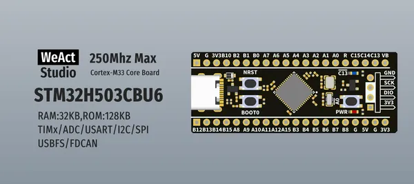

# STM32H503 Core Board

**WeAct Studio** · Other

Revision: Not identified

Coverage: Board labels only; pinout needed

[Browse all manufacturers](../../../../BROWSE.md) · [Devices & IoT](../../../../DEVICES.md) · [Open in the browser guide](https://valleytech-black-wire-guide.pages.dev/?board=weact-studio-other-stm32h503-core-board)

## Datasheets and original documentation

Board datasheet: **not yet recorded**. Visual reference: **available**.

[Manufacturer source (recorded link)](https://github.com/WeActStudio/WeActStudio.STM32H503CoreBoard)

A chip datasheet, schematic and board datasheet have different scopes. Match the exact hardware revision.

[Documentation coverage and remaining gaps](../../../../DOCUMENTATION.md)

## Board silkscreen and component labels

**board labeling image** · Reviewed source · PNG

[Open original reference](../../../../library/media/d9a0a06589b7bdff721edf367c23f2d43db5959319a89289067094e89f9ccf23.png)

**Credit and rights:** Not established; source attribution retained. Source/manufacturer: WeAct Studio.

[Source 1](https://raw.githubusercontent.com/WeActStudio/WeActStudio.STM32H503CoreBoard/0ff5a945ef108fff9ed9645288d1efe001811c90/Images/1.png) · [Source 2](https://github.com/WeActStudio/WeActStudio.STM32H503CoreBoard/blob/0ff5a945ef108fff9ed9645288d1efe001811c90/Images/1.png)

Original repository file preserved with commit identifier. Board illustration/silkscreen images are explicitly distinguished from expanded pin-function diagrams.

Image revision: Not identified

SHA-256: `d9a0a06589b7bdff721edf367c23f2d43db5959319a89289067094e89f9ccf23`

Pin assignments have not been independently electrically verified. Check board revision before wiring.
