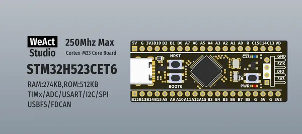
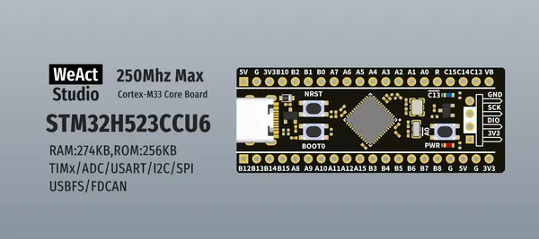

# STM32H523 Core Board

**WeAct Studio** · Other

Revision: Not identified  
Coverage: Board labels only; pinout needed

[Browse all manufacturers](../../../../BROWSE.md) · [Desktop app](https://github.com/valleytechsolutions/black-wire-desktop)

## Board silkscreen and component labels

**board labeling image** · Reviewed source · PNG

[Open original reference](../../../../library/media/1f5e947539212616ada1e6f85e4e8615279c1c3fdcfc75efe159225854f4385a.png)

**Credit and rights:** Not established; source attribution retained. Source/manufacturer: WeAct Studio.

[Source 1](https://raw.githubusercontent.com/WeActStudio/WeActStudio.STM32H523CoreBoard/86bddc6dbe976ef0a963d5742ea326639c7566b7/Images/1.png) · [Source 2](https://github.com/WeActStudio/WeActStudio.STM32H523CoreBoard/blob/86bddc6dbe976ef0a963d5742ea326639c7566b7/Images/1.png)

Original repository file preserved with commit identifier. Board illustration/silkscreen images are explicitly distinguished from expanded pin-function diagrams.

**Partial diagram. Confirm missing pins against the exact board documentation.**

SHA-256: `1f5e947539212616ada1e6f85e4e8615279c1c3fdcfc75efe159225854f4385a`

## Board silkscreen and component labels

**board labeling image** · Reviewed source · PNG

[Open original reference](../../../../library/media/e7388fbd3c55d184a007e01730da1ef1242ac7289d159143ed6f4fd146bba9f5.png)

**Credit and rights:** Not established; source attribution retained. Source/manufacturer: WeAct Studio.

[Source 1](https://raw.githubusercontent.com/WeActStudio/WeActStudio.STM32H523CoreBoard/86bddc6dbe976ef0a963d5742ea326639c7566b7/Images/2.png) · [Source 2](https://github.com/WeActStudio/WeActStudio.STM32H523CoreBoard/blob/86bddc6dbe976ef0a963d5742ea326639c7566b7/Images/2.png)

Original repository file preserved with commit identifier. Board illustration/silkscreen images are explicitly distinguished from expanded pin-function diagrams.

**Partial diagram. Confirm missing pins against the exact board documentation.**

SHA-256: `e7388fbd3c55d184a007e01730da1ef1242ac7289d159143ed6f4fd146bba9f5`

Pin assignments have not been independently electrically verified. Check board revision before wiring.
