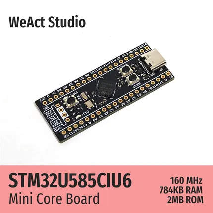

# STM32U585Cx Core Board

**WeAct Studio** · Other

Revision: Not identified  
Coverage: Board labels only; pinout needed

[Browse all manufacturers](../../../../BROWSE.md) · [Desktop app](https://github.com/valleytechsolutions/black-wire-desktop)

## Board silkscreen and component labels

**board labeling image** · Reviewed source · PNG

[Open original reference](../../../../library/media/2357d5915c67159dae6fcbe942acaf488a82449386bb9327f6f42b07e42c70bc.png)

**Credit and rights:** Not established; source attribution retained. Source/manufacturer: WeAct Studio.

[Source 1](https://raw.githubusercontent.com/WeActStudio/WeActStudio.STM32U585Cx_CoreBoard/c1fe6b70a7cb20c3c9794c6f9f4f306c358d19f8/Images/1.png) · [Source 2](https://github.com/WeActStudio/WeActStudio.STM32U585Cx_CoreBoard/blob/c1fe6b70a7cb20c3c9794c6f9f4f306c358d19f8/Images/1.png)

Original repository file preserved with commit identifier. Board illustration/silkscreen images are explicitly distinguished from expanded pin-function diagrams.

**Partial diagram. Confirm missing pins against the exact board documentation.**

SHA-256: `2357d5915c67159dae6fcbe942acaf488a82449386bb9327f6f42b07e42c70bc`

Pin assignments have not been independently electrically verified. Check board revision before wiring.
